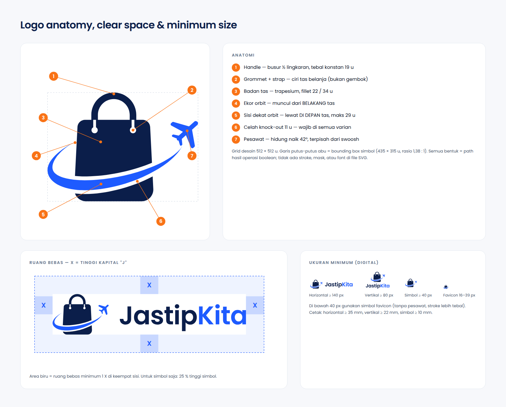

# JastipKita — Brand Guide v1.0

> **Titip Mudah, Aman, Terpercaya.**
> Marketplace P2P: penitip (buyer) menitip belanja ke traveler terverifikasi yang sedang di luar negeri, dana ditahan **SafePay** sampai barang diterima.

Semua aset di dokumen ini dihasilkan oleh `brand/scripts/generate-assets.mjs` (lihat `brand/README.md`). **Jangan menggambar ulang atau mengekspor ulang logo dari file raster** — ubah geometri di `brand/scripts/lib/geometry.mjs`, lalu jalankan ulang generator. Pratinjau lengkap: `brand/preview/brand-sheet.png`.

---

## 1. Logo

### 1.1 Konsep & anatomi

Konsep dikunci pemilik: **tas belanja + pesawat + orbit**.

1. **Handle** — busur setengah lingkaran, tebal konstan 19 u.
2. **Grommet + strap** — strap masuk ke badan lewat 2 lubang bulat → terbaca "tas belanja", bukan gembok. Lubang bulat menggemakan titik huruf "i" pada Poppins.
3. **Badan tas** — trapesium membulat (alas 11 % lebih lebar), fillet atas 22 u / bawah 34 u.
4. **Ekor orbit** — runcing, muncul dari **belakang** tas (sisi jauh orbit tersembunyi).
5. **Sisi dekat orbit** — elips miring −15°, lewat **di depan** tas, lebar maksimum 29 u.
6. **Celah knock-out** 11 u — memisahkan orbit dari tas; wajib ada di semua varian (termasuk 1 warna).
7. **Pesawat** — tampak atas, hidung naik 42° (lepas landas), terpisah dari ujung swoosh.

| Elemen | Warna (light) | Makna |
|---|---|---|
| Tas + handle | navy-900 `#0B1E4A` | belanja, kepercayaan, stabil |
| Orbit + pesawat | cobalt-500 `#1E5BFF` | perjalanan global, gerak, teknologi |
| Celah putih (knock-out) | transparan | memisahkan lapisan; membuat versi 1 warna tetap terbaca |

Grid desain 512 × 512 u. Semua bentuk dibangun dari primitif geometris (fillet lingkaran sejati, busur elips, stroke lebar-variabel) lalu di-*flatten* dengan operasi boolean → SVG hanya berisi `<path>` (tanpa mask, stroke, atau font). Wordmark **Poppins SemiBold 600, tracking −1,5 %**, sudah dikonversi ke outline: "Jastip" navy + "Kita" cobalt.

### 1.2 Varian

| Varian | File | Pakai untuk |
|---|---|---|
| Horizontal (utama) | `logo/jastipkita-horizontal*.svg` | header web, dokumen, email, invoice |
| Vertikal | `logo/jastipkita-vertical*.svg` | splash, poster, merchandise, area persegi |
| Vertikal + tagline | `logo/jastipkita-vertical-tagline*.svg` | materi marketing, deck, halaman "Tentang" |
| Simbol | `logo/jastipkita-symbol*.svg` | avatar, app icon, watermark, loading |
| Simbol favicon | `logo/jastipkita-symbol-favicon*.svg` | ≤ 32 px: favicon, notifikasi, tab |
| Wordmark saja | `logo/jastipkita-wordmark*.svg` | ruang sangat sempit **di samping simbol yang sudah tampil** (mis. app bar) |

Setiap varian punya 4 warna: default (latar terang), `-dark` (latar gelap/navy: tas & "Jastip" off-white `#F7F8FB`, aksen cobalt-400 `#4D7DFF`), `-mono-black`, `-mono-white`.

### 1.3 Ruang bebas (clear space)

**X = tinggi huruf kapital "J" pada wordmark** (≈ 0,36 × tinggi lockup horizontal).

- Horizontal & vertikal: ruang bebas minimal **1 X** di keempat sisi.
- Simbol saja: ruang bebas minimal **25 % tinggi simbol**.
- Tidak boleh ada teks, ikon, tepi foto, atau batas kartu di dalam ruang bebas.

File SVG sudah menyertakan padding 0,25 X — ruang bebas penuh (1 X) tetap wajib disediakan oleh layout.

### 1.4 Ukuran minimum

| Varian | Digital | Cetak |
|---|---|---|
| Horizontal | lebar 140 px | lebar 35 mm |
| Vertikal | lebar 80 px | lebar 22 mm |
| Vertikal + tagline | lebar 160 px (di bawah itu, pakai tanpa tagline) | lebar 40 mm |
| Simbol (lengkap, dengan pesawat) | 40 px | 10 mm |
| Simbol favicon | 16–39 px | 4–9 mm |
| Wordmark saja | lebar 96 px | lebar 25 mm |

Di bawah 40 px generator otomatis memakai geometri favicon (tanpa pesawat, handle & swoosh lebih tebal, grommet lebih besar). Pada 48 px ke atas selalu pakai simbol lengkap.

### 1.5 Do & Don't

**Lakukan**
- Pakai file dari `brand/logo/` apa adanya; skala proporsional.
- Pakai varian `-dark` di atas navy-900/950 atau foto gelap; `-mono-white` di atas foto ramai atau warna brand.
- Pastikan kontras latar: varian default hanya di atas putih, off-white `#F7F8FB`, atau slate-100.

**Jangan**
- ✗ Mengubah warna "Jastip"/"Kita", atau mewarnai tas dengan cobalt.
- ✗ Memutar, memiringkan, menekan (stretch), atau memberi outline/shadow/glow/gradien pada logo.
- ✗ Memindah posisi pesawat, membalik arah orbit, atau menghapus celah knock-out.
- ✗ Menempatkan logo di atas **efek kaca (glass/blur)** yang di baliknya ada konten ramai — gunakan permukaan opak.
- ✗ Mengetik ulang wordmark dengan font lain (termasuk Poppins "live text") — selalu pakai outline.
- ✗ Menambahkan tagline ke lockup horizontal (tagline hanya di lockup vertikal atau sebagai teks terpisah).
- ✗ Memakai simbol lengkap di bawah 40 px (pesawat berubah jadi noise) — gunakan simbol favicon.
- ✗ Menggunakan logo untuk menyiratkan kemitraan/endorsement pihak ketiga (maskapai, bandara, Bea Cukai).

---

## 2. Warna

Token lengkap (termasuk semantik light/dark): `packages/design-tokens/tokens.json`. Warna di tabel ini **dikunci** — hex tidak boleh diubah.

| Token | Hex | RGB | Peran | Rasio pakai |
|---|---|---|---|---|
| navy-900 (primary) | `#0B1E4A` | 11, 30, 74 | brand, app bar, judul light mode, CTA sekunder | ~25 % |
| cobalt-500 (secondary) | `#1E5BFF` | 30, 91, 255 | CTA utama, link, fokus, aksen logo | ~10 % |
| offwhite-50 | `#F7F8FB` | 247, 248, 251 | latar light mode | ~55 % (bersama putih) |
| ink-900 | `#0F172A` | 15, 23, 42 | teks utama light | teks |
| slate-500 | `#64748B` | 100, 116, 139 | teks sekunder (di atas putih) | teks |
| navy-950 | `#070B19` | 7, 11, 25 | latar dark mode | dark |
| navy-800 | `#12295F` | 18, 41, 95 | surface elevated dark | dark |
| cobalt-400 | `#4D7DFF` | 77, 125, 255 | CTA & aksen di dark mode | dark |
| emerald-600 | `#059669` | 5, 150, 105 | sukses, PAYMENT SECURED | ≤ 5 % |
| orange-500 | `#F97316` | 249, 115, 22 | peringatan, perubahan harga | ≤ 5 % |
| red-600 | `#DC2626` | 220, 38, 38 | error, DO NOT PURCHASE, barang terlarang | ≤ 5 % |

**Aturan rasio 55 / 25 / 10 / 5 / 5** — permukaan terang dominan, navy sebagai jangkar, cobalt hemat (hanya untuk hal yang bisa diklik atau aksen), warna status hanya untuk status.

**Aksesibilitas.** Setiap pasangan teks/latar yang dideklarasikan diverifikasi otomatis (WCAG AA: 4,5:1 teks, 3:1 non-teks) — lihat `packages/design-tokens/CONTRAST.md`. Temuan penting yang memengaruhi pemakaian:
- slate-500 di atas off-white = 4,48:1 (**gagal tipis**). Di atas latar halaman pakai `onBackgroundMuted` (slate-600); slate-500 hanya di atas kartu putih.
- Teks putih di atas emerald-600 = 3,77:1 (**gagal**). Banner PAYMENT SECURED memakai emerald-700 `#047857` (5,48:1); emerald-600 dipakai untuk ikon/indikator.
- Teks putih di atas orange-500 = 2,80:1 (**gagal**). Isi oranye selalu memakai teks ink-900 (6,37:1).
- Dark mode: tombol cobalt-400 memakai label navy-950 (5,32:1), bukan putih (3,69:1).

---

## 3. Tipografi

**Poppins** (SIL OFL 1.1, `brand/fonts/OFL.txt`) — 400 Regular · 500 Medium · 600 SemiBold · 700 Bold (+ 400 Italic).

| Peran | Style | Contoh |
|---|---|---|
| Display / hero | 700, 40/48, −2 % | "Titip Mudah, Aman." |
| Headline | 600, 32–24, −1,5 … −0,5 % | judul halaman |
| Title | 600, 20/18/16 | judul kartu, app bar |
| Body | 400, 16/14/12 | paragraf, deskripsi |
| Label | 500, 14/12/11, +0,5 … +4 % | tombol, chip, caption |
| Money | 600 / 500, **tabular figures** (`tnum`) | Rp 11.577.140 |

Aturan: maksimal 2 bobot per komponen; jangan pakai 700 untuk teks panjang; angka uang selalu tabular & rata kanan dalam tabel; format Rupiah `Rp 1.234.567` (spasi setelah Rp, titik ribuan, tanpa desimal).

File: `apps/mobile/assets/fonts/Poppins-*.ttf` (Flutter), `apps/{web,admin}/public/fonts/*.woff2` + `poppins.css` (latin & latin-ext, `font-display: swap`).

---

## 4. Suara & nada (voice & tone)

Bahasa Indonesia (default), hangat, jelas, dan **jujur soal uang**. Kita bicara seperti teman yang teliti — bukan sales, bukan birokrat.

| Prinsip | Lakukan | Hindari |
|---|---|---|
| Hangat | "Titipan kamu sudah dibeli Dimas 🙌" (emoji hanya di notifikasi/chat, maksimal 1) | "Transaksi Anda telah diproses oleh sistem." |
| Transparan | "Bea masuk **estimasi** Rp 312.400 — nilai final ditetapkan Bea Cukai." | "Biaya lain-lain", "biaya admin" tanpa rincian |
| Tegas soal keamanan | "**Jangan beli dulu.** Pembayaran penitip belum aman." | "Sebaiknya menunggu pembayaran ya kak~" |
| Tidak menyalahkan | "Link ini belum bisa kami baca. Coba foto barangnya?" | "URL tidak valid!" |
| Jujur soal integrasi | label **SANDBOX** di fitur yang belum live | mengklaim "terintegrasi" padahal mock |

- Sapaan: **"kamu"** di aplikasi; **"Anda"** hanya di dokumen legal/kontrak.
- Istilah tetap: *penitip*, *traveler*, *titipan*, *SafePay*, *JastipKita Protection*, *Trust Score*. Jangan diterjemahkan bolak-balik.
- Status kritis selalu 2 bahasa di UI traveler: "Jangan beli dulu / DO NOT PURCHASE", "Pembayaran aman / PAYMENT SECURED".
- Angka: selalu sebut mata uang dan apakah estimasi. Waktu: WIB default ("14:32 WIB").
- Hindari janji absolut ("100 % aman", "pasti sampai"). Gunakan "dilindungi", "ditahan SafePay", "dijamin sesuai ketentuan".

---

## 5. App icon

- Latar: gradien navy (navy-700 → navy-900 → `#081738`) + cahaya cobalt lembut di kanan atas (di balik pesawat). Android adaptive memakai warna solid navy-900 (`values/ic_launcher_background.xml`).
- Simbol: tas **putih**, orbit & pesawat **cobalt-400**. Lebar simbol 74 % sisi ikon (iOS/Play), atau jari-jari luar ≤ 31 dp dalam safe-zone 66 dp (adaptive).
- iOS: 1024 full-bleed, **tanpa alpha, tanpa sudut membulat** (sistem yang memasker). Ukuran < 48 px memakai geometri favicon.
- Android 13 themed icon: `ic_launcher_monochrome.png` = siluet putih; sistem yang mewarnai.
- Notifikasi: `ic_stat_jastipkita` = siluet putih 24 dp (geometri favicon), tanpa warna.
- Jangan menambah teks, badge "NEW", atau bingkai ke ikon. Varian musiman harus lewat review brand.

---

## 6. Inventaris aset

Daftar lengkap per file (100 berkas, dengan tujuan masing-masing) ada di `brand/preview/asset-inventory.json` — di-generate setiap kali generator dijalankan. Ringkasan:

| File | Fungsi |
|---|---|
| `brand/logo/jastipkita-{horizontal,vertical,vertical-tagline,symbol}.svg` | Logo warna penuh, latar terang |
| `brand/logo/jastipkita-{…}-dark.svg` | Logo warna penuh, latar gelap/navy |
| `brand/logo/jastipkita-{…}-mono-black.svg` / `-mono-white.svg` | Logo satu warna |
| `brand/logo/jastipkita-symbol-favicon{,-dark}.svg` | Simbol sederhana ≤ 32 px |
| `brand/logo/jastipkita-wordmark{,-dark}.svg` | Wordmark saja |
| `brand/app-icon/ios/AppIcon.appiconset/Icon-App-*.png` (15 file) + `Contents.json` | iOS: 20/29/40/58/60/76/80/87/120/152/167/180/1024 px, opaque; manifest layout default Flutter |
| `brand/app-icon/ios/Contents.single-size.json` | Alternatif manifest Xcode 14+ single-size (1024 universal) |
| `brand/app-icon/android/mipmap-{mdpi…xxxhdpi}/ic_launcher.png` | Launcher legacy (rounded square) 48–192 px |
| `brand/app-icon/android/mipmap-{…}/ic_launcher_round.png` | Launcher legacy bulat 48–192 px |
| `brand/app-icon/android/mipmap-{…}/ic_launcher_foreground.png` | Lapisan depan adaptive icon 108–432 px, simbol dalam safe-zone 66 dp |
| `brand/app-icon/android/mipmap-{…}/ic_launcher_monochrome.png` | Lapisan themed icon Android 13 |
| `brand/app-icon/android/mipmap-anydpi-v26/ic_launcher{,_round}.xml` | Definisi adaptive icon (background + foreground + monochrome) |
| `brand/app-icon/android/values/ic_launcher_background.xml` | Warna latar adaptive (navy-900) |
| `brand/app-icon/android/drawable-{…}/ic_stat_jastipkita.png` | Ikon notifikasi 24–96 px, putih transparan |
| `brand/app-icon/android/playstore-icon-512.png` | Ikon listing Google Play |
| `brand/web/icon-192.png`, `icon-512.png` | PWA (purpose any, tile membulat) |
| `brand/web/icon-maskable-512.png` | PWA maskable (safe circle 80 %) |
| `brand/web/apple-touch-icon.png` | 180 px, opaque |
| `brand/web/favicon-{16,32,64,256,512}.png`, `favicon.ico` (16/32/48), `favicon.svg` | Favicon |
| `brand/web/site.webmanifest` | Manifest PWA (theme navy, background off-white) |
| `brand/splash/splash-logo-{light,dark}.png` | Splash flutter_native_splash (1152², transparan) |
| `brand/splash/android12-splash-icon{,-dark}.png` | Ikon splash Android 12+ (dalam lingkaran 768 px) |
| `brand/splash/splash-branding{,-dark}.png` | Wordmark branding bawah splash (800×240) |
| `brand/social/profile-{1080,400}.png` | Foto profil (aman untuk crop lingkaran) |
| `brand/social/og-image-1200x630.png` | Open Graph / link preview |
| `brand/social/cover-1500x500.png` | Header media sosial |
| `brand/store/play-feature-graphic-1024x500.png` | Feature graphic Google Play (tanpa alpha) |
| `brand/store/app-store-icon-1024.png` | Ikon App Store Connect (tanpa alpha) |
| `brand/fonts/OFL.txt` | Lisensi Poppins |
| `apps/mobile/assets/fonts/Poppins-{Regular,Italic,Medium,SemiBold,Bold}.ttf` | Font Flutter |
| `apps/{web,admin}/public/fonts/*.woff2`, `poppins.css` | Font web (latin + latin-ext) |
| `brand/preview/brand-sheet.png`, `logo-anatomy.png` | Contact sheet QA; diagram anatomi, ruang bebas, ukuran minimum |
| `docs/design/mockups/*.png` | Mockup hi-fi (light & dark) — lihat `docs/05-ui-design-system.md` |

---

*Catatan keterbatasan:* logo v1.0 dibuat dan di-QA secara digital (render PNG); belum diuji cetak (CMYK/Pantone belum ditetapkan) dan belum melalui pengecekan merek dagang (DJKI/PDKI). Nilai CMYK & Pantone perlu ditetapkan bersama vendor cetak sebelum produksi materi fisik.
