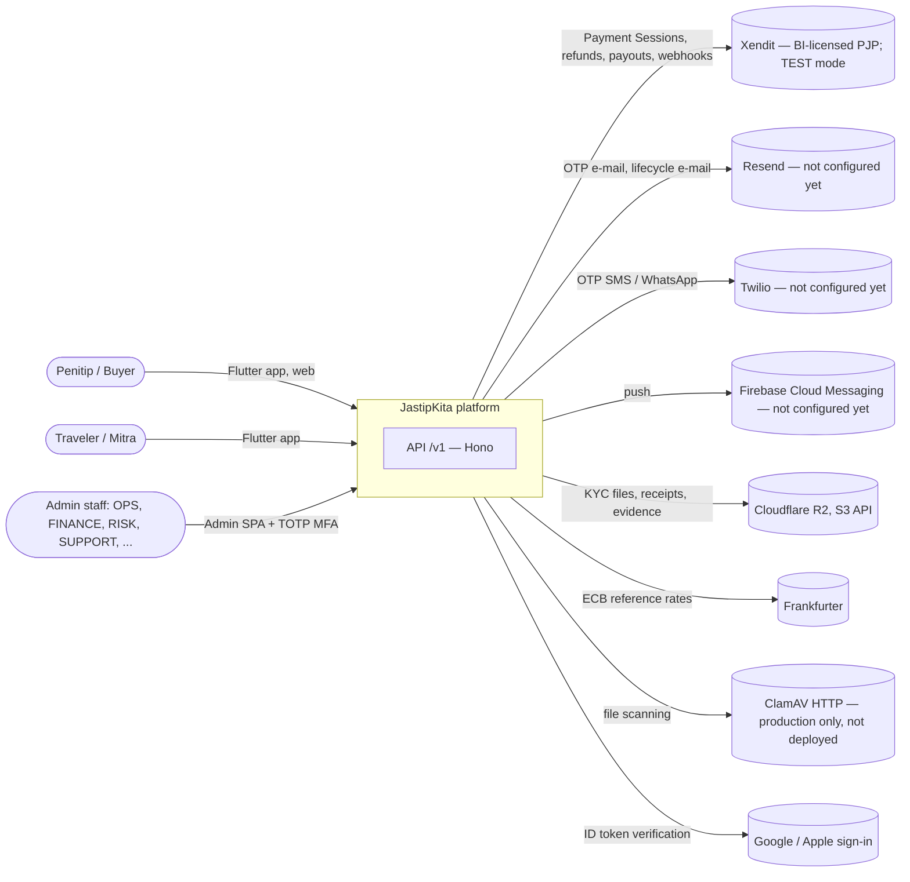
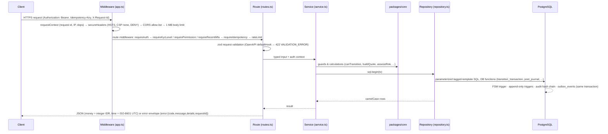
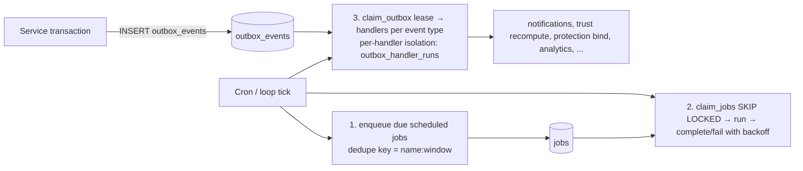
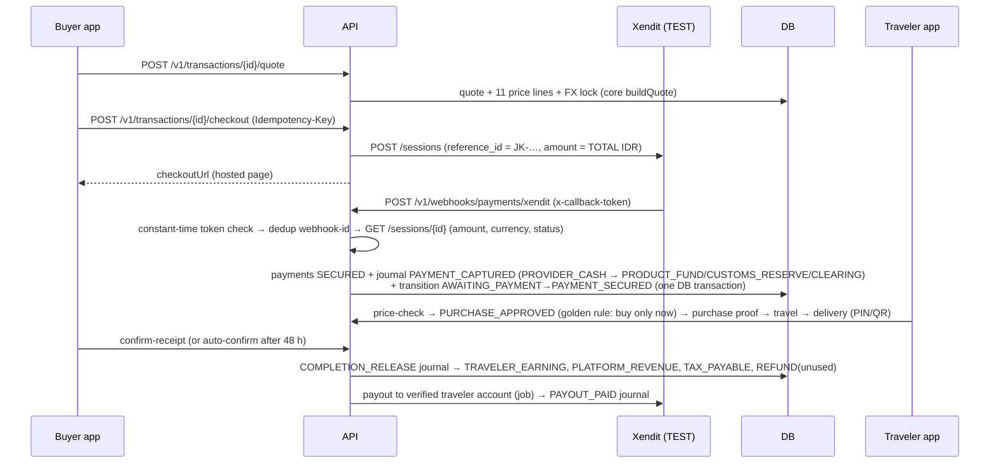
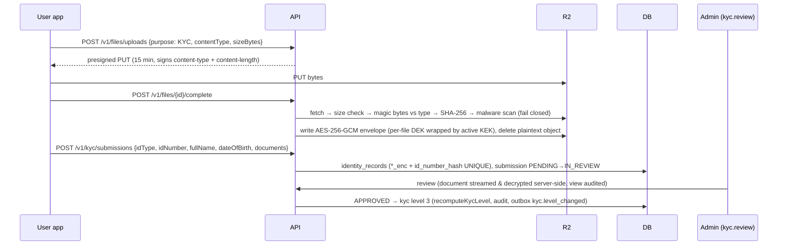
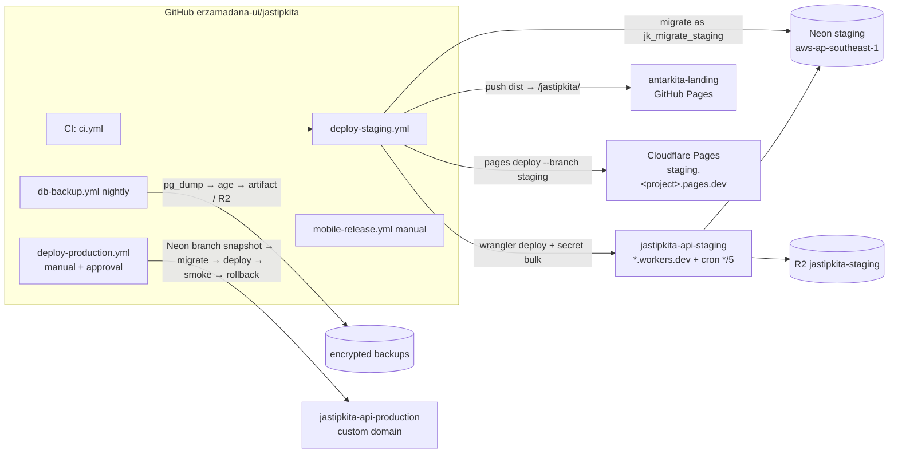

# 01 — Architecture

> Status: **pre-launch, all integrations MOCK/SANDBOX.** Nothing described here is live. Binding rules live in
> `docs/00-domain-model.md` (domain), `docs/03-database.md` (schema), `docs/04-payments-ledger.md` (money) and
> `CONVENTIONS.md`. This document explains how the pieces fit and how they are deployed.

## 1. System context



Money never touches a JastipKita bank account: buyer funds sit in the payment provider balance and are *held by
accounting* in ledger buckets until delivery is confirmed (ADR 0005, `docs/04-payments-ledger.md` §2).

## 2. Containers

```mermaid
flowchart TB
  subgraph Clients
    mobile[apps/mobile — Flutter, one app, BUYER/TRAVELER modes]
    web[apps/web — Astro static site<br/>antarkitaindonesia.com/jastipkita]
    admin[apps/admin — React SPA, not indexed]
  end
  subgraph Edge[Cloudflare]
    worker[API Worker — apps/api/src/worker.ts<br/>fetch() = HTTP · scheduled() = worker tick]
    pages[Pages / GitHub Pages — static hosting]
  end
  subgraph Data
    pg[(PostgreSQL — Neon<br/>schema db/migrations, roles jk_migrator / jk_app / jk_readonly)]
    obj[(R2 bucket — files, KYC envelopes)]
  end
  core[[packages/core — pure engines<br/>pricing, customs, FX, FSMs, trust, fraud, limits...]]
  mobile & web & admin -->|HTTPS JSON, Bearer JWT| worker
  worker --> core
  worker -->|postgres.js over TCP, TLS| pg
  worker -->|SigV4 presign / get / put| obj
  mobile -. presigned PUT .-> obj
  web & admin --- pages
```

| Container | Tech | Runs on (staging) | Notes |
|---|---|---|---|
| API | Hono + `@hono/zod-openapi`, zod, postgres.js, jose, aws4fetch | Cloudflare Workers (Free) | Same code runs on Node (`server.node.ts`, `apps/api/Dockerfile`) — ADR 0002 |
| Worker tick | `runWorkerTick()` | Workers Cron Trigger every 5 min | Node: in-process loop every 5 s or `worker.node.ts` |
| Core engines | TypeScript, no I/O | bundled into API, web, admin | 100% unit-tested, doc↔code FSM parity test |
| Database | PostgreSQL 16/17, plain SQL migrations | Neon Free, `aws-ap-southeast-1` | Provider-agnostic (ADR 0003) |
| Object storage | S3 API | Cloudflare R2 | presigned uploads; KYC/TRIP_DOC re-encrypted server-side |
| Web | Astro, static | GitHub Pages via `antarkita-landing` repo | ADR 0007 |
| Admin | React SPA | Cloudflare Pages (preview branch `staging`) | Cloudflare Access recommended |
| Mobile | Flutter | Play/App Store (not submitted) | web build served at `/jastipkita/app/` |

## 3. Request lifecycle



Rules that make the lifecycle safe: status changes only through the state machine (`transition_transaction()` +
core guard), every financial/config/role/trust change writes `audit_logs` as the last statement, notifications are
never sent inline — the service writes an outbox event in the same transaction and the worker delivers it.

## 4. Module groups (API)

| Group | Modules (`apps/api/src/modules/…`) | Jobs file | Migration range | Doc |
|---|---|---|---|---|
| identity | auth, me, files, kyc, privacy | `jobs/identity.ts` | 0020–0029 | `docs/api/identity.md` |
| marketplace | catalog, fx, customs, restricted, trips, requests, offers, matching | `jobs/marketplace.ts` | 0030–0039 | `docs/api/marketplace.md` |
| money | transactions, checkout, payments, webhooks, ledger, price-confirmation, purchase, delivery, cancellation, refunds, payouts, reconciliation | `jobs/money.ts` | 0040–0049 | `docs/api/money.md`, `docs/04-payments-ledger.md` |
| engagement | notifications, chat, ratings, disputes, referrals, credits, promotions, support, analytics, trust | `jobs/engagement.ts` | 0050–0059 | `docs/api/engagement.md` |
| admin | `/v1/admin/*` (dashboard, users, KYC, trips, transactions, disputes, finance, settlement, config, rules, growth, risk, audit, system/DB Center, content) | `jobs/admin.ts` | 0060–0069 | (in progress) |

## 5. Providers abstraction

Every external dependency sits behind an interface in `apps/api/src/providers/<kind>/` with a MOCK implementation
for dev/test. `GET /v1/health → integrations` reports the mode of each one and must never claim LIVE when sandboxed.

| Kind | Implementations | Env switch | Staging plan |
|---|---|---|---|
| payment | mock, xendit | `PAYMENT_PROVIDER`, `XENDIT_ENV` | xendit **test** (SANDBOX) |
| email | log, resend | `EMAIL_PROVIDER` | log (MOCK) until Resend is set up |
| sms | log, twilio | `SMS_PROVIDER` | log (MOCK) |
| push | log, fcm | `PUSH_PROVIDER` | log (MOCK) |
| storage | memory, s3 | `STORAGE_PROVIDER` | s3 → R2 (memory is refused outside dev) |
| fx | static, frankfurter | `FX_PROVIDER` | frankfurter (ECB reference) |
| kyc | manual, mock | `KYC_PROVIDER` | manual review queue |
| malware | none, mock, clamav-http | `MALWARE_SCAN_PROVIDER` | mock (ClamAV cannot run in a Worker) |
| insurance | none, mock | `INSURANCE_PROVIDER` | mock |
| extraction | heuristic, mock | `EXTRACTION_PROVIDER` | heuristic (SSRF-guarded fetch) |
| db-admin | generic, neon | `DB_ADMIN_PROVIDER` | generic (`neon` throws "not wired yet") |

## 6. Outbox & jobs



* One tick is safe to run concurrently on many instances (SKIP LOCKED, leases, dedupe keys).
* ~21 scheduled jobs (e.g. `money.expire_payments` 60 s, `money.process_payouts` 5 min, `money.daily_reconciliation`
  24 h, `identity.privacy.retention_purge` 24 h). On Workers the Cron Trigger fires every 5 minutes, so 60-second
  jobs effectively run every 5 minutes (quote/payment/price-confirmation expiry can lag ≤ 5 min). The domain
  handles late expiry safely (late payment → `LATE_PAYMENT_CAPTURED` + automatic refund).

## 7. Security architecture (summary — details in `docs/09-security.md`)

| Layer | Control |
|---|---|
| Transport | TLS everywhere (Cloudflare edge, Neon `sslmode=require`, R2 HTTPS); HSTS 2 years + preload header |
| Identity | Passwordless: OTP (HMAC-stored, 5 attempts, cooldowns) + Google/Apple ID tokens (ADR 0004); JWT 15 min; opaque refresh token rotation with reuse detection; admin TOTP step-up ≤ 15 min |
| Authorization | RBAC permissions per admin route, ownership checks in services, KYC level gates, maker-checker in DB CHECKs |
| Data | AES-256-GCM (AAD per row/column) + key rotation by `kid`; HMAC-SHA256 with pepper for lookups; masked outputs (`****0961`) |
| Database | Least-privilege roles: API = `jk_app` (DML only, no DDL/TRUNCATE, append-only tables INSERT only); migrations = `jk_migrator`; BI = `jk_readonly` (column-level, no PII) |
| Integrity | Append-only triggers on ledger/audit/events; SHA-256 hash-chained `audit_logs`; double-entry ledger balanced at COMMIT |
| Money | Webhook token compared in constant time + provider re-verification (GET) + event dedup + idempotency keys |
| Supply chain / CI | frozen lockfile, Dependabot, OSV-Scanner, pnpm audit, gitleaks + custom secret guard, least-privilege workflow permissions |

## 8. Data flows

### 8.1 Money (SafePay)



Refunds follow `docs/04-payments-ledger.md` §6 (provider refund where the channel supports it, otherwise payout to a
validated buyer account; maker-checker above `money.policy.refundAutoApproveMaxIdr`).

### 8.2 KYC



## 9. Deployment topology



| | Staging | Production (later, owner approval) |
|---|---|---|
| API | `jastipkita-api-staging.<subdomain>.workers.dev` | `jastipkita-api.antarkitaindonesia.com` (zone on Cloudflare DNS) |
| DB | Neon Free, PITR 6 h | Neon paid plan with ≥ 7-day PITR (`docs/08-backup-dr.md` §2) |
| Payments | Xendit TEST (SANDBOX) | Xendit LIVE only after contract + legal + recorded decision |
| Web | `antarkitaindonesia.com/jastipkita/` | same site (single GitHub Pages environment) |
| Admin | `staging.<project>.pages.dev` | Pages production + Cloudflare Access |

**Path-based API URL caveat:** `apps/web` currently defaults to `https://api.antarkitaindonesia.com/jastipkita`.
A Worker route with a path prefix would forward `/jastipkita/v1/...` but the app only serves `/v1/...` (no base-path
stripping in `worker.ts`). Use a dedicated hostname, or ask the API owner to add base-path support first.

## 10. Workers FREE plan — risk list

Limits per Cloudflare documentation (verify at deploy time): 10 ms CPU per invocation (HTTP and Cron),
100 000 requests/day, 128 MB memory, 50 external subrequests per invocation, 3 MB compressed bundle.
Measurements below were taken in this repository on Node 22 (V8, same engine family as workerd) — ASUMSI that
workerd behaves similarly.

| # | Risk | Evidence | Likelihood / when it breaks | Mitigation (owner) |
|---|---|---|---|---|
| W1 | **CPU limit on every request.** `worker.ts` rebuilds `createApp()` (≈ 126 OpenAPI routes) per request | measured median **7.2 ms CPU** for `createApp` alone; **≈ 15 ms** median for env + deps + app + trivial `/health` | High — likely from the first real traffic (error 1102). Cloudflare may tolerate bursts, not guaranteed | Cache the app per isolate and inject the per-request `sql` (API team, code change). If still > 10 ms: Workers Paid US$5/month (**owner approval**) |
| W2 | File completion (`/files/{id}/complete`) hashes + AES-GCM-encrypts up to 10 MB (video evidence 50 MB) inside the request | size limits in `docs/api/identity.md` §4 | High for KYC/evidence uploads on Free (CPU, and 128 MB memory for 50 MB with copies) | Workers Paid, or run file processing on the Node container; lower video size |
| W3 | Cron tick CPU: ~21 scheduled jobs + outbox in one 10 ms invocation | `jobs/runner.ts` | Medium–High as data grows | Smaller batches per tick, Paid plan, or Node worker (`worker.node.ts`) |
| W4 | One new Postgres connection (TCP + TLS + SCRAM) per request to Neon | `worker.ts` (`max: 1`, `prepare: false`) | Latency (ASUMSI +50–150 ms/request), pooler churn | Smart Placement (enabled in wrangler.toml), Cloudflare Hyperdrive (availability on Free = NEEDS_VERIFICATION, code change) |
| W5 | 60-second jobs run every 5 min | cron `*/5` | Certain; functional impact small | Accept for staging; `* * * * *` on Paid if needed |
| W6 | In-memory rate limiter is per isolate | `middleware/rate-limit.ts` | Certain; weak protection against distributed abuse | DB limits already cover OTP/login/payment; add a Cloudflare WAF rate-limiting rule (needs the zone on Cloudflare) |
| W7 | Neon Free compute quota: `*/5` cron keeps compute awake 24/7 | ASUMSI 720 h × 0.25 CU = 180 CU-h vs ASUMSI 100 CU-h free | **Staging DB suspended around day 16–17 of each month** if the allowance is 100 CU-h | Change cron to `*/15`, or Neon paid (**owner approval**) |
| W8 | Malware scanning impossible in a Worker | `providers/malware` | Certain → staging MOCK | Production: clamd service (hosting cost, **owner approval**) |
| W9 | Bundle size | measured **484 KiB gzip** (2.3 MB raw) | Low (limit 3 MB) | CI reports size each run |
| W10 | 100k requests/day | ASUMSI 1 000 DAU × 50 req = 50k/day | Low until real traction | Paid plan removes daily cap |

**What breaks first:** W1/W2 on the first real test sessions (CPU errors on normal requests and on KYC uploads),
then W7 around mid-month. The $0 target is realistic for a *demo* staging; it is **not** realistic for a public
production launch.

## 11. Scaling path

| Stage | Trigger (measure first) | Change | Cost (ASUMSI, verify) |
|---|---|---|---|
| 0 — now | pre-launch | Workers Free + Neon Free + R2 free tier | US$0 (R2 may require a card on file) |
| 1 — closed beta | W1/W2 errors or > 50k req/day | Workers Paid; app cached per isolate; Neon paid plan with 7-day PITR | ≈ US$5 + US$19–30/month |
| 2 — public | p95 latency > 800 ms, DB CPU > 60 % | Hyperdrive/pooling, read replica for admin/BI, separate Node worker for heavy jobs & file processing | + US$20–50/month |
| 3 — growth | sustained > 50 req/s, large tables | Containers (Cloud Run/Fly/K8s) using `apps/api/Dockerfile`, table partitioning (`audit_logs`, `analytics_events`, ledger by month), queue service | case by case |

The code already supports stage 3 without rewrites: Node entry points, provider-agnostic SQL, stateless API,
DB-backed jobs with SKIP LOCKED.

## 12. ADR index

| ADR | Decision |
|---|---|
| [0001](adr/0001-monorepo-pnpm.md) | Monorepo with pnpm workspaces |
| [0002](adr/0002-hono-workers-node-portability.md) | Hono on Cloudflare Workers with Node portability |
| [0003](adr/0003-postgresql-provider-agnostic.md) | Provider-agnostic PostgreSQL, Neon for staging |
| [0004](adr/0004-passwordless-auth.md) | Passwordless authentication |
| [0005](adr/0005-double-entry-ledger-psp-funds.md) | Double-entry ledger; funds held by a licensed PSP, not by JastipKita |
| [0006](adr/0006-flutter-single-app-two-modes.md) | One Flutter app with buyer and traveler modes |
| [0007](adr/0007-astro-web-under-antarkita.md) | Astro static web under antarkitaindonesia.com/jastipkita |
| [0008](adr/0008-config-versioning-maker-checker.md) | Versioned business configuration with maker-checker |

---

**Catatan keterbatasan data:** limit Cloudflare/Neon diambil dari dokumentasi publik yang dapat berubah dan belum
diverifikasi ulang saat penulisan; angka CPU diukur di Node 22 pada mesin build (bukan di workerd produksi);
kuota Neon (CU-jam) dan biaya tahap 1–3 adalah **ASUMSI**; seluruh integrasi berstatus MOCK/SANDBOX.
