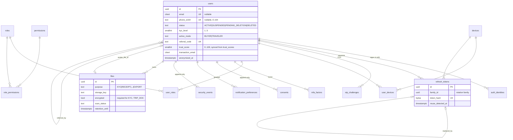
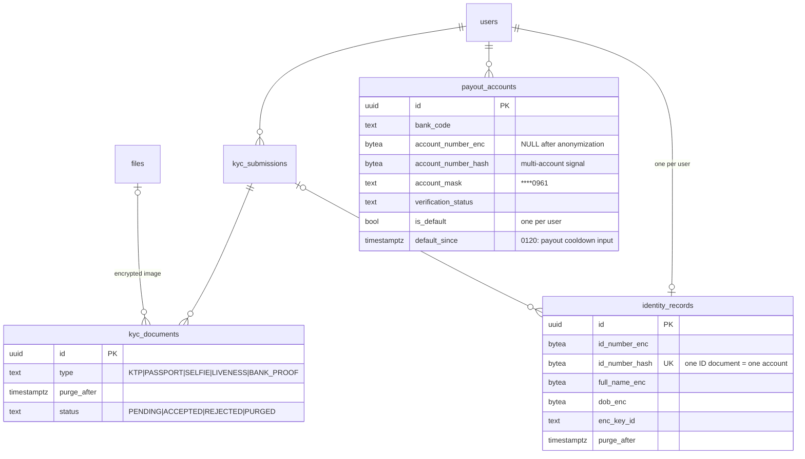
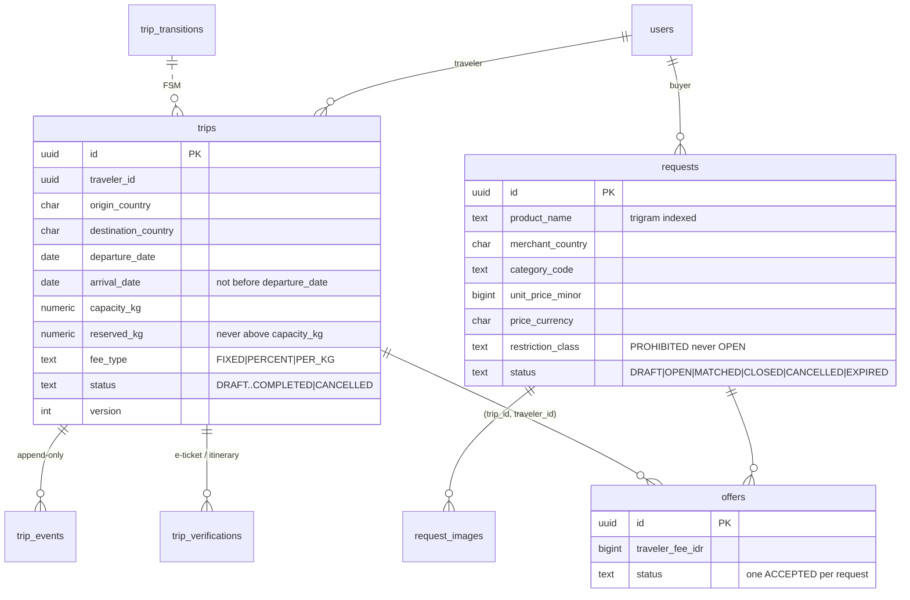
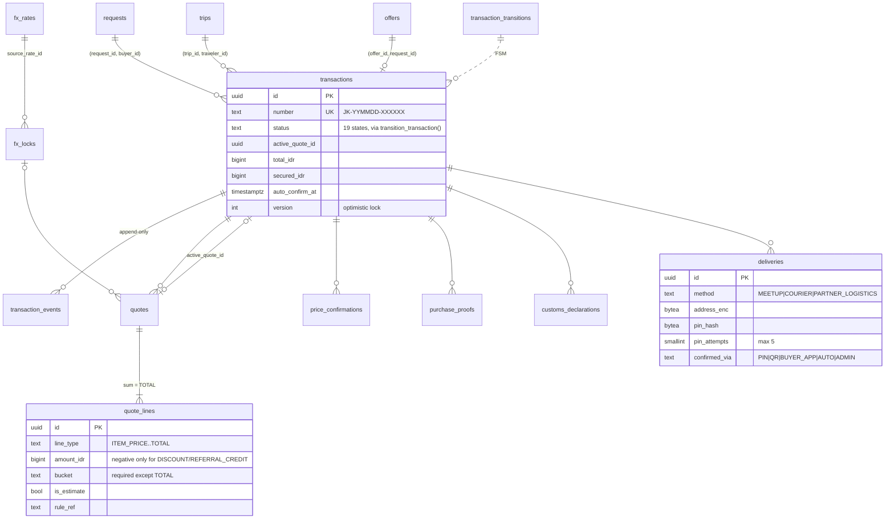
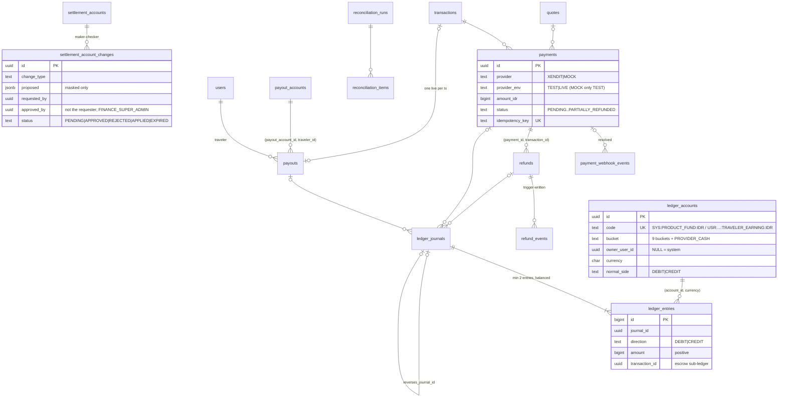
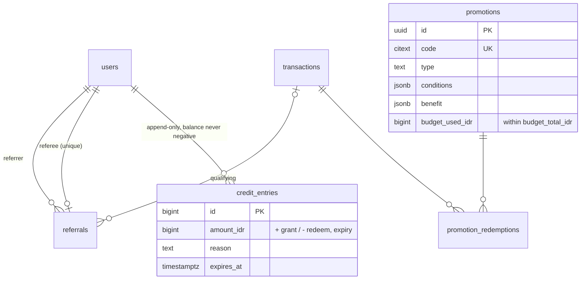
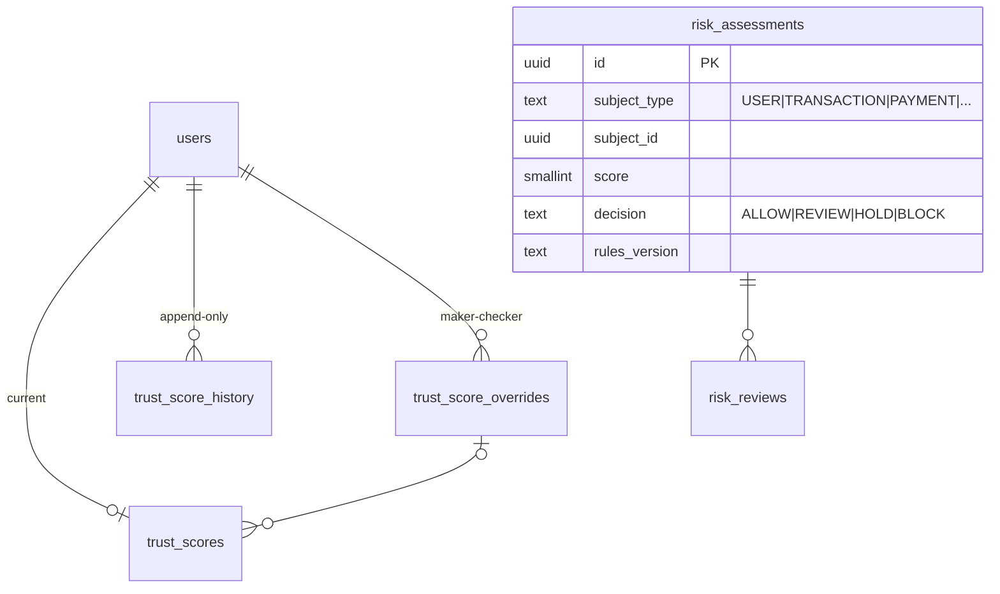
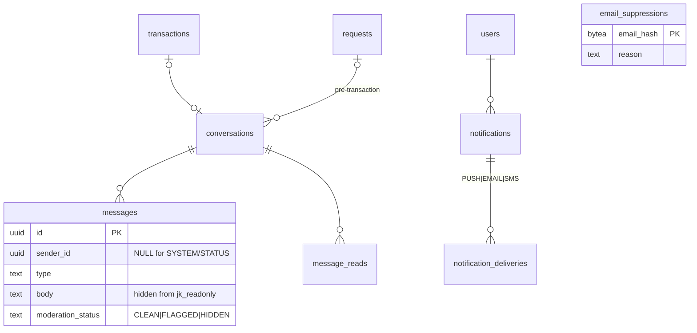
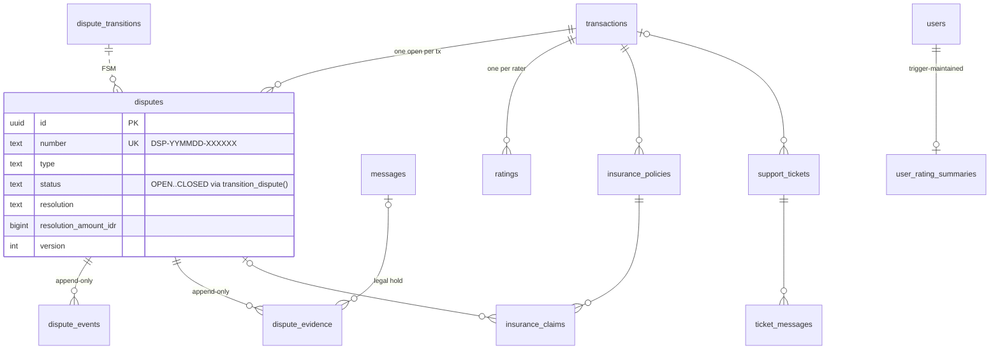
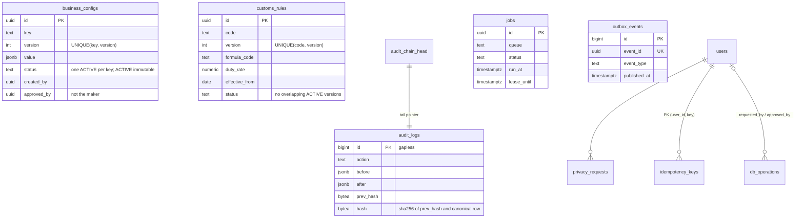

# JastipKita — Database (PostgreSQL)

Status: schema v1 (migrations `0001`–`0017`, domain model rev. 2), verified by `bash db/scripts/test-db.sh` on PostgreSQL 16.
Binding domain rules: [`docs/00-domain-model.md`](00-domain-model.md). Migration mechanics:
[`db/migrations/README.md`](../db/migrations/README.md).

---

## 1. Overview

| Item | Value |
|---|---|
| Engine | PostgreSQL **15+** (uses `UNIQUE NULLS NOT DISTINCT`, `CREATE OR REPLACE TRIGGER`) |
| Extensions | `pgcrypto`, `citext`, `pg_trgm`, `btree_gist` (all "trusted", available on Neon/Supabase/RDS/Cloud SQL) |
| Objects | 101 tables, 18 views, ~65 functions, ~450 indexes, 17 migrations |
| Access | Only the API (`apps/api`) connects. Clients never touch the DB; no RLS dependence |
| Schema | `public` (the API's search_path); provider API roles are stripped of access (§7.1) |

Conventions (from `CONVENTIONS.md`, enforced in DDL):

* **PK** `uuid DEFAULT gen_random_uuid()`. Append-only logs use `bigint GENERATED ALWAYS AS IDENTITY`.
  Reference/lookup tables use their natural code as PK (`currencies.code`, `countries.code`,
  `product_categories.code`, `roles.code`, `permissions.code`, `feature_flags.key`) because those codes
  are what config JSON, rules and API guards reference.
* **Money** `bigint` minor units + `char(3)` currency (FK `currencies`). IDR columns are named `*_idr`.
  FX rates `numeric(20,10)`; tax/fee rates `numeric(9,6)`; percentages in config as bps.
* **Enumerations** `text` + `CHECK (... IN (...))`, values exactly as `00-domain-model.md`.
* **Timestamps** `timestamptz` (UTC); `created_at DEFAULT now()`, `updated_at` via trigger `set_updated_at()`.
  Day/month buckets in analytics use `AT TIME ZONE 'Asia/Jakarta'` (WIB).
* **Human numbers** `JK-YYMMDD-XXXXXX`, `DSP-…`, `RFD-…`, `TKT-…`, `PO-…` (Crockford base32, WIB date),
  assigned by trigger `jk_assign_number()` with collision retry + UNIQUE constraint.
* **Encrypted PII** `*_enc bytea` (envelope ciphertext from the API) + `*_hash bytea` (HMAC-SHA256 for
  dedupe/lookup) + `enc_key_id`. The DB never sees plaintext KTP/passport numbers, DOB, bank account
  numbers, addresses, TOTP secrets or KYC images (images live in object storage; `files.encrypted` is
  mandatory for purpose `KYC`/`TRIP_DOC`).

## 2. Domain grouping

| Domain | Migration | Tables |
|---|---|---|
| Foundation | 0001 | `schema_migrations`, `status_transitions`, `jk_sensitive_columns`, `jk_grant_policies` |
| Reference | 0002 | `currencies`, `countries`, `product_categories` |
| Identity & access | 0003 | `users`, `auth_identities`, `refresh_tokens`, `otp_challenges`, `devices`, `user_devices`, `roles`, `permissions`, `role_permissions`, `user_roles`, `mfa_factors`, `mfa_recovery_codes`, `consents`, `notification_preferences`, `security_events`, `files` |
| Audit & plumbing | 0004 | `audit_logs`, `audit_chain_head`, `audit_chain_checkpoints`, `outbox_events`, `jobs`, `idempotency_keys` |
| Config & rules | 0005 | `business_configs`, `feature_flags`, `experiments`, `experiment_assignments`, `customs_rules`, `restricted_items`, `faq_articles`, `legal_documents` |
| KYC | 0006 | `kyc_submissions`, `kyc_documents`, `identity_records`, `payout_accounts` |
| Trips & requests | 0007 | `trips`, `trip_transitions`, `trip_events`, `trip_verifications`, `requests`, `request_images`, `offers` |
| Transactions | 0008 | `transactions`, `transaction_transitions`, `transaction_events`, `fx_rates`, `fx_locks`, `quotes`, `quote_lines`, `price_confirmations`, `purchase_proofs`, `customs_declarations`, `deliveries` |
| Payments & ledger | 0009 | `payments`, `payment_webhook_events`, `ledger_accounts`, `ledger_journals`, `ledger_entries`, `refunds`, `refund_events`, `payouts`, `settlement_accounts`, `settlement_account_changes`, `reconciliation_runs`, `reconciliation_items` |
| Growth | 0010 | `referrals`, `credit_entries`, `promotions`, `promotion_redemptions` |
| Trust & risk | 0011 | `trust_scores`, `trust_score_history`, `trust_score_overrides`, `risk_assessments`, `risk_reviews` |
| Communication | 0012 | `conversations`, `messages`, `message_reads`, `notifications`, `notification_deliveries`, `email_suppressions` |
| Disputes & support | 0013 | `ratings`, `user_rating_summaries`, `disputes`, `dispute_transitions`, `dispute_events`, `dispute_evidence`, `insurance_policies`, `insurance_claims`, `support_tickets`, `ticket_messages` |
| Privacy & ops | 0014 | `privacy_requests`, `data_retention_policies`, `analytics_events`, `db_operations`, `app_health_checks` |

Views: `v_user_consents_current`, `v_business_configs_active`, `v_fx_rates_latest`, `ledger_balances`,
`ledger_bucket_balances`, `v_transaction_ledger`, `credit_balances`, `v_transaction_limits_usage`,
`v_app_health_latest`, `v_customs_rules_in_force`, `v_restricted_items_in_force` (0017), and the metric views of 0015 (`v_funnel_daily`, `v_completed_transaction_lines`,
`v_gmv_daily`, `v_take_rate`, `v_refund_rate`, `v_dispute_rate`, `v_traveler_utilization`).

## 3. ERDs

Attributes are abridged to keys and the columns that drive behaviour. `users` appears in most
domains; FKs to `users`, `files`, `currencies`, `countries` are omitted where they add noise.

### 3.1 Identity & access



### 3.2 KYC



### 3.3 Trips & requests



### 3.4 Transactions



### 3.5 Payments & ledger



### 3.6 Growth



### 3.7 Trust & risk



### 3.8 Communication



### 3.9 Disputes, ratings, insurance, support



### 3.10 Config, audit, ops, privacy



## 4. State machines

| Machine | Table of truth | Mutation path | Notes |
|---|---|---|---|
| Transaction (§4) | `transaction_transitions` (44 rows) | `transition_transaction()` only | direct `UPDATE ... SET status` is rejected (`JK422`) |
| Trip (§15.1) | `trip_transitions` (17 rows) | `transition_trip()` only | `UNVERIFIED_ACTIVE` edges: API checks `trips.allowUnverifiedActive` |
| Dispute (§15.3) | `dispute_transitions` (10 rows) | `transition_dispute()` only | |
| Price confirmation (§15.2), KYC submission (§15.4), Payment (§15.5), Refund (§15.6), Payout (§15.7), Quote & FX lock (§15.8) | `status_transitions(machine, from, to, actor_types, note)` | plain `UPDATE`, pair checked by `jk_enforce_fsm()`; **initial status** checked on INSERT by `jk_fsm_initial()` (payout `SCHEDULED`, refund `REQUESTED`, payment/price confirmation/KYC `PENDING`, quote/FX lock `ACTIVE`) | actors are stored for the service layer (the DB cannot know the actor of a plain UPDATE); refund status changes auto-write `refund_events` |
| Settlement change, Trust override | inline in guard triggers | `UPDATE` + `apply_*()` functions | maker-checker (§7.4) |

All tables except §15.8 are **parsed from the markdown tables of `docs/00-domain-model.md`** (§4, §15.1–§15.7,
including the `{A, B}` multi-source syntax) by `db/scripts/gen-reference-seed.mjs`; the generator rejects
statuses/actors the DB CHECK constraints would not accept, and `--check` fails in CI when the doc changes
without regenerating `db/seeds/0001_reference.sql`.

`transition_transaction(p_tx, p_expected_version, p_to, p_actor_type, p_actor_id, p_reason, p_meta)`:

1. `SELECT ... FOR UPDATE` the row → `JK404` if missing.
2. `version <> p_expected_version` → `JK409` (DETAIL `{"currentVersion":n,"currentStatus":"…"}`).
3. `(from, to)` not in the transitions table → `JK422`; actor not in `actor_types` → `JK403`.
4. Update status, `version + 1`, milestone timestamps (`delivered_at`, `completed_at`, `cancelled_*`, …).
5. Insert `transaction_events`, `outbox_events` (`transaction.status_changed`) and `audit_logs`
   (last, see §8) — all in the caller's DB transaction. Returns the updated row.

Guards other than the actor (KYC level, quote/FX lock validity, capacity, cancellation matrix, …) are
the API service layer's job (`packages/core` state machine), exactly as the brief specifies. The API
should map `JK409 → 409 VERSION_CONFLICT`, `JK422 → 409/422 ILLEGAL_TRANSITION`, `JK403 → 403`.

## 5. Data dictionary (key tables)

### `transactions`
| Column | Type | Notes |
|---|---|---|
| `number` | text UK | `JK-YYMMDD-XXXXXX`, trigger-assigned |
| `request_id`, `buyer_id` | uuid | composite FK → `requests(id, buyer_id)` (buyer must own request) |
| `trip_id`, `traveler_id` | uuid | composite FK → `trips(id, traveler_id)`; required once past `REQUEST_CREATED` |
| `offer_id` | uuid | composite FK → `offers(id, request_id)` |
| `status` | text | 19 values of §4; initial must be `REQUEST_CREATED` |
| `active_quote_id` | uuid | FK `quotes` (deferrable) |
| `total_idr`, `secured_idr` | bigint | landed cost, amount secured by SafePay |
| `purchase_deadline`, `auto_confirm_at` | timestamptz | partial indexes drive the expiry / auto-confirm jobs |
| `cancelled_by`, `cancelled_by_type`, `cancellation_stage` | | stage from `p_meta.cancellationStage` |
| `version` | int | optimistic lock, bumped by `transition_transaction()` |

One live transaction per request (`UNIQUE (request_id) WHERE status NOT IN ('CANCELLED','REFUNDED')`).

### `quotes` / `quote_lines`
Immutable pricing evidence. `quotes` only allows `status`, `accepted_at`, `superseded_by` to change
(one `ACTIVE` quote per transaction). `quote_lines` are append-only; every line except `TOTAL` names
its `bucket`; a deferred constraint trigger checks at COMMIT that `TOTAL = Σ other lines = quotes.total_idr`
("no fee that is not in the breakdown", §10). `config_versions` / `rule_refs` record which
`business_configs` versions and customs/restricted rules were used.

### `payments` / `payment_webhook_events`
`provider_env` distinguishes `TEST`/`LIVE`; `MOCK` can only be `TEST` (CHECK) — the admin UI must show a
SANDBOX badge for `TEST`. `idempotency_key` UK; `(provider, provider_env, provider_ref)` UK. The webhook
inbox is keyed by `UNIQUE (provider, event_id)` (dedupe); `payload`/`signature_valid` are immutable and
only `payment_id`, `processed_at`, `processing_error`, `attempts` may change (trigger + column grants).

### Ledger
* `ledger_accounts`: one per `(bucket, owner_user_id, currency)` (`NULLS NOT DISTINCT`), system accounts
  `SYS:<BUCKET>:IDR` seeded; per-traveler `TRAVELER_EARNING` created by `ensure_ledger_account()`.
  Normal side: `PROVIDER_CASH`, `PAYMENT_FEE`, `PROMOTION_CREDIT`, `CLEARING` = DEBIT; others CREDIT.
* `ledger_journals` (append-only, `idempotency_key` UK, `reverses_journal_id` UK) and `ledger_entries`
  (append-only, `amount > 0`, `direction`, composite FK `(account_id, currency)` so an entry can never
  post a different currency than its account).
* Deferred constraint triggers: each journal has ≥ 2 entries (`JKL01`) and Σdebit = Σcredit **per
  currency** (`JKL02`) at COMMIT. Posting to a FROZEN/CLOSED account fails (`JKL03`).
* `post_journal(kind, description, entries jsonb, transaction_id, idempotency_key, refs, actor)`;
  `reverse_journal(journal, reason, actor)` for corrections (compensating entries, never updates).
* Views: `ledger_balances` (per account, signed by normal side), `ledger_bucket_balances`,
  `v_transaction_ledger` (escrow per transaction & bucket).

### `business_configs`
`UNIQUE (key, version)`; partial unique index → one `ACTIVE` per key. `ACTIVE` rows can only become
`SUPERSEDED`; `SUPERSEDED`/`REJECTED` are frozen; `approved_by <> created_by`. Use
`activate_business_config(id, approver)` (supersedes the old version, audits, emits outbox). Version 1
of every key in `business-config.defaults.json` is seeded ACTIVE; keys listed in `_meta.assumptions`
carry `is_assumption = true`.

### `customs_rules` / `restricted_items` (exact contracts shared with seed authors)
Column names/types exactly as specified; extras are nullable/defaulted (`id`, `created_by`,
`approved_by`, `approved_at`, `created_at`, `updated_at`, plus `verified_by`/`notes` on restricted
items). `UNIQUE (code, version)`; exclusion constraint (btree_gist) forbids overlapping `ACTIVE`
versions of the same code using **inclusive** ranges `daterange(effective_from, effective_until, '[]')`
(§16; NULL upper bound = open-ended), so v2 must start the day **after** v1's `effective_until`. ACTIVE rows
are immutable except retirement (`status → RETIRED`, `effective_until`) and re-verification metadata.
Lookup: `customs_rules_in_force(d)` / `restricted_items_in_force(d)` (default today WIB) and the views
`v_customs_rules_in_force` / `v_restricted_items_in_force`, all using
`d BETWEEN effective_from AND coalesce(effective_until, 'infinity')` and `status = 'ACTIVE'`.

### `currencies`
`code` PK, `minor_units`, `name`, `symbol`, `ecb_reference` (0017; `false` = not in the ECB reference set,
so the `frankfurter` FX provider cannot quote it — e.g. TWD, VND, AED, SAR), seeded from `currencies.json`.

### `audit_logs`
`id` gapless, `occurred_at` forced to DB time, `prev_hash`, `hash = sha256(prev_hash ‖ utf8(canonical))`
where canonical = `jsonb_build_array(id, occurred_at UTC µs, actor_type, actor_id, actor_role, action,
entity_type, entity_id, request_id, hex(ip_hash), before, after, meta)::text`. `verify_audit_chain(from, to)`
returns the first broken id (tampered row, broken link, deleted row, truncated tail) or `NULL`.

## 6. Plumbing

* **Outbox** `outbox_events`: written in the same transaction as the state change (the transition
  functions do it); relays call `claim_outbox(worker, limit, lease_seconds)` (SKIP LOCKED + lease),
  set `published_at`; published rows may be purged, content is immutable.
* **Jobs** `jobs`: `claim_jobs(queue, worker, limit, lease_seconds)` — `FOR UPDATE SKIP LOCKED` ordered
  by `(priority, run_at, id)`; `complete_job`, `fail_job` (exponential backoff 2^attempts s, cap 1 h,
  ±25% jitter, `DEAD` after `max_attempts`), `reap_expired_jobs()` for crashed workers;
  `dedupe_key` unique while QUEUED/RUNNING.
* **Idempotency** `idempotency_keys` PK `(user_id, key)`, `request_hash`, stored response, `expires_at`
  (24 h default). Financial tables additionally carry their own unique `idempotency_key`
  (`payments`, `refunds`, `payouts`, `ledger_journals`, `credit_entries`).
* **Actor context**: the API may `SET LOCAL jk.actor_type/jk.actor_id/jk.request_id`; trigger-written
  rows (refund events, audit `request_id`) pick them up.

## 7. Security model

### 7.1 Roles
| Role | Purpose | Privileges |
|---|---|---|
| `jk_migrator` (NOLOGIN) | owner of every object; DDL | owns tables/views/functions; `CREATE` on DB & schema |
| `jk_app` (NOLOGIN) | API runtime | DML only. Append-only tables: `SELECT, INSERT`. Restricted tables: `SELECT, INSERT` + column `UPDATE`. History tables (`settlement_account_changes`, `trust_score_overrides`, `business_configs`, `customs_rules`, `restricted_items`, `legal_documents`, `settlement_accounts`): no `DELETE`. State-machine & registry tables: `SELECT`. Never `TRUNCATE`, `TRIGGER`, `REFERENCES`, DDL. `EXECUTE` on runtime functions (not the DDL helpers). |
| `jk_readonly` (NOLOGIN) | BI / analytics | `SELECT` on tables & views, **column-level** where a table has sensitive columns. Hidden: any `*_enc`, `*_hash`, `password*`, `*secret*`, `*token*` column; registered PII (`users.email/phone_e164/transaction_email/display_name`, `messages.body/attachments`, `ticket_messages.body`, `notifications.body`, `payout_accounts.holder_name`, `deliveries.meetup_point`, webhook `payload/headers`, outbox/job payloads, `files.storage_key`); whole tables `identity_records`, `auth_identities`, `refresh_tokens`, `otp_challenges`, `mfa_*`, `idempotency_keys`. No writes, no function execution. |

`jk_apply_grants()` recomputes every privilege from the catalog: append-only/restricted status is
**derived from the guard triggers** (`trg_append_only`, `trg_restrict_update` args), sensitivity from
the naming rule + `jk_sensitive_columns`, overrides from `jk_grant_policies`. It also strips any access
of provider API roles `anon` / `authenticated` (Supabase) and `PUBLIC`. It is idempotent; every
migration that adds tables ends with `SELECT jk_apply_grants();`. `ALTER DEFAULT PRIVILEGES` gives
`jk_app` DML on new objects immediately and gives `jk_readonly` **nothing** until classified.

LOGIN users are created per environment/provider (never in migrations):

```sql
CREATE ROLE jk_api_prod     LOGIN PASSWORD '<from secret manager>' IN ROLE jk_app;
CREATE ROLE jk_bi_prod      LOGIN PASSWORD '<...>' IN ROLE jk_readonly;
CREATE ROLE jk_migrate_prod LOGIN PASSWORD '<...>' IN ROLE jk_migrator;
```

### 7.2 Encryption columns
| Table | Ciphertext | Lookup hash | Display |
|---|---|---|---|
| `identity_records` | `id_number_enc`, `full_name_enc`, `dob_enc` | `id_number_hash` (UNIQUE: one ID → one account) | — |
| `payout_accounts` | `account_number_enc` | `account_number_hash` (indexed: same account on many users = fraud signal) | `account_mask` `****0961` |
| `deliveries` | `address_enc` | — | `address_city` (coarse) |
| `mfa_factors` | `secret_enc` | — | — |
| `settlement_accounts` | none — `secret_ref` points to the secret manager (`vault://…`, CHECK rejects ≥8-digit numbers) | — | `account_mask`, `holder_name_mask` |

Hashes are HMAC-SHA256 with a server key (not plain SHA) so low-entropy values (phone, account numbers)
cannot be brute-forced from a DB dump. `enc_key_id` enables key rotation (re-encrypt rows by key id).

### 7.3 Append-only enforcement
Trigger `trg_append_only` (BEFORE UPDATE/DELETE + BEFORE TRUNCATE, raises `JK001`) **and** grants
(jk_app has no UPDATE/DELETE) on: `transaction_events`, `trip_events`, `dispute_events`,
`dispute_evidence`, `refund_events`, `ledger_journals`, `ledger_entries`, `audit_logs`,
`audit_chain_checkpoints`, `credit_entries`, `consents`, `trust_score_history`, `security_events`,
`risk_assessments`, `fx_rates`, `quote_lines`.
Narrow, documented exceptions (trigger `jk_restrict_update(cols)` + column-level UPDATE grant):
* `payment_webhook_events`: `payment_id, processed_at, processing_error, attempts`.
* `quotes`: `status, accepted_at, superseded_by`; `fx_locks`: `status, consumed_at`.
* `outbox_events`: delivery bookkeeping only; published rows may be deleted (retention).
* `business_configs`: ACTIVE → SUPERSEDED only; `customs_rules`/`restricted_items`: ACTIVE → RETIRED + verification metadata.
* `settlement_account_changes`, `trust_score_overrides`: status/decision columns until a final state, then frozen.
* `legal_documents`: immutable once `published_at` is set (except `retired_at`).
Superusers can bypass triggers (`ALTER TABLE … DISABLE TRIGGER`, `session_replication_role`); the audit
hash chain + external checkpoints make that detectable (tested).

### 7.4 Maker-checker
* **Settlement accounts**: `settlement_accounts` can only be written by `apply_settlement_account_change()`
  (guard trigger). A change request needs `finance.settlement.request_change` + MFA step-up ≤ 15 min;
  approval needs a **different** user (`CHECK approved_by <> requested_by`) holding role
  **`FINANCE_SUPER_ADMIN`** and `finance.settlement.approve_change` with fresh MFA; requests expire after
  72 h; APPLIED/REJECTED/EXPIRED rows are frozen; `proposed` may only contain masked values.
  `SUPER_ADMIN` alone cannot approve.
* **Trust overrides**: requester needs `trust.override.request`, approver `trust.override.approve`,
  approver ≠ requester ≠ subject; applied via `apply_trust_score_override()` (writes history + audit).
* **Config**: `approved_by <> created_by`; activation through `activate_business_config()`.
* **Refunds**: `approved_by <> requested_by`; cumulative refunds ≤ payment amount (trigger).
* **DB operations**: `RESTORE`, `IMPORT`, `SWITCH`, `ROLLBACK` cannot leave `REQUESTED` without an approver ≠ requester.

### 7.5 Audit chain
Linearity is enforced by a single-row `audit_chain_head` locked `FOR UPDATE` inside the SECURITY
DEFINER trigger: writers queue on it until the previous writer commits (READ COMMITTED) or get a
serialization failure (REPEATABLE READ/SERIALIZABLE) — the chain can never fork. The head also makes a
truncated tail detectable. Periodically copy `(last_id, last_hash)` to WORM storage and record it in
`audit_chain_checkpoints` so even a privileged rewrite of the whole chain is detectable.
All financial/config/trust/role changes must be audited (`CONVENTIONS.md`); the DB functions in this
schema already do so for transitions, config activation, settlement changes, trust overrides, journal
reversals and anonymization.

## 8. Performance notes

* **Hot-path indexes**: matching (`trips_match_idx (destination_country, origin_country, arrival_date) WHERE status='ACTIVE'`,
  city variant; `requests_open_idx … WHERE status='OPEN'`, `requests_status_country_idx`), transactions by
  buyer/traveler/status/`updated_at`, unread notifications (`WHERE read_at IS NULL`), job claim
  (`(queue, priority, run_at, id) WHERE status='QUEUED'`), unpublished outbox, unprocessed webhooks,
  latest FX by pair (`(base, quote, as_of DESC)`), trigram GIN on `requests.product_name` and FAQ
  `search_text`, GIN on `restricted_items.keywords`, `text_pattern_ops` on HS prefixes.
* **Every FK has an index** (asserted by `tests/110_integrity.sql`).
* **Audit head lock** serializes audit writers for the remainder of their transaction. Keep audit
  inserts the **last** statement before COMMIT (the transition functions do) and keep those
  transactions short. Expected ceiling: hundreds of audited writes/second, far above launch volume.
  If it becomes a bottleneck, move to per-partition chains or asynchronous sealing.
* **Ledger balances** are computed views; fine for launch volumes (indexed by `(account_id, currency, id)`).
  At scale add a daily `ledger_balance_snapshots` table and sum only entries after the snapshot.
* **Deferred constraint triggers** (journal balance, quote totals) run once per inserted row at COMMIT;
  journals/quotes are small (≤ ~12 rows) so the cost is negligible.
* **analytics_events** is high-volume: BRIN on `received_at`, no FK on `user_id`. Convert to monthly
  range partitions (`PARTITION BY RANGE (occurred_at)`) before ~50M rows; retention job drops partitions.
* `jobs`/`outbox_events`: partial indexes stay tiny; purge finished rows (retention policies) to limit bloat.
  `audit_chain_head` uses `fillfactor=50` for HOT updates.
* Use a pooler in **transaction mode** safely: the schema relies only on transaction-scoped state
  (`SET LOCAL`, `pg_advisory_xact_lock`, `set_config(..., true)`), no session advisory locks or temp tables.

## 9. Privacy (UU PDP) & retention

`anonymize_user(user, actor, purge_kyc)`:
* **Refuses** (`JK423`) while the user has non-terminal transactions, open disputes, pending payouts or
  in-flight refunds.
* **Removes/scrubs now**: email/phone/password/name/avatar/transaction email; auth identities, sessions,
  OTPs, MFA, device links, notification prefs & inbox, idempotency responses, experiment assignments,
  analytics events; chat message text (except messages referenced as dispute evidence — legal hold),
  support ticket text, rating comments, request/trip notes; delivery address, meetup point, PIN/QR
  hashes; payout account ciphertext and holder name; personal files (avatar/chat/export) flagged for purge;
  remaining non-withdrawable credit forfeited with an `EXPIRY` credit entry.
* **Keeps**: transactions, quotes, payments, refunds, payouts, ledger, credit entries, events, audit logs,
  consents (evidence of consent), ratings (scores), payout `account_mask`/`account_number_hash`.
  **Why**: tax/bookkeeping and dispute/chargeback obligations require these records and UU PDP permits
  retention needed to meet legal obligations; they reference the person only through the UUID, which
  after scrubbing identifies no one (pseudonymous). Audit logs are designed to hold ids, not PII.
* **KYC**: encrypted identity data and images are scheduled for purge after the configured period
  (`data_retention_policies.identity_records`, default 5 years — **assumption**) or immediately with
  `purge_kyc = true`. A purge job deletes `identity_records` rows and storage objects when due.
* Emits `user.anonymized` to the outbox (storage purge, email/push providers) and an audit entry.
* The API should add the user's email HMAC to `email_suppressions` before calling (the DB cannot compute it).

`data_retention_policies` is seeded with research-free defaults, **all flagged `is_assumption = true`**
(KYC 5 y after closure, financial records 10 y, messages 2 y, analytics 13 months, OTP 30 d, …) and
editable from Admin. `privacy_requests.due_at` defaults to 72 h (assumption based on the 3×24-hour
windows in UU PDP 27/2022 — to be confirmed by counsel).

## 10. Provider portability

| Topic | Neon | Supabase | AWS RDS / Aurora | Cloud SQL |
|---|---|---|---|---|
| Extensions used | all available | all available (installed into `extensions` schema if pre-created; that schema is on the default search_path) | all available | all available |
| Creating roles | project owner (CREATEROLE) | `postgres` (CREATEROLE) | master user (`rds_superuser`) | `cloudsqlsuperuser` |
| Superuser | no | no | no | no |
| `GRANT jk_migrator TO <admin>` (0016) | ✓ | ✓ | ✓ | ✓ |
| PITR / backups | branches + history retention | daily backups, PITR add-on | automated snapshots + PITR | automated backups + PITR |
| Pooling | built-in PgBouncer (transaction mode) | Supavisor (transaction mode) | RDS Proxy | Cloud SQL Auth Proxy / PgBouncer |
| Gotchas | scale-to-zero cold starts: give job workers a connect timeout of at least 5 s | **PostgREST exposes `public`**: this schema revokes `anon`/`authenticated` on every object (`jk_apply_grants()`); additionally remove `public` from "Exposed schemas" in API settings. Don't use `service_role` from the API — create a LOGIN member of `jk_app`. | run 0001 as the master user (or grant it `CREATE` on the database) so the trusted extensions install | run 0001 as a `cloudsqlsuperuser` member; all four extensions are on the supported list |

Nothing depends on superuser: trusted extensions, no `session_replication_role`, no event triggers,
no `pg_cron` (scheduling lives in the API worker + `jobs`), no Supabase `auth.*` schema, no RLS.
Tests that disable triggers (audit tamper simulation) are test-only and need the table owner.

## 11. Operating procedures

```bash
bash db/scripts/test-db.sh                      # full verification on a scratch DB (CI)
DATABASE_URL=... db/scripts/migrate.sh          # deploy: migrations (as jk_migrator member)
DATABASE_URL=... db/scripts/seed.sh             # deploy: reference data (idempotent)
DATABASE_URL=... db/scripts/migrate.sh --verify # drift check
```

Test coverage (325 checks at time of writing): transaction/trip/dispute FSMs incl. version
conflict & illegal transitions; append-only on 16 tables; ledger balance at real COMMIT; audit chain
verification and tamper/delete/truncation detection; concurrent audit writers; maker-checker for
settlement/trust/config/refunds/db ops; one ACTIVE config per key & immutability; job claim with
SKIP LOCKED (sequential and with two live sessions); idempotency keys; `anonymize_user`; jk_app /
jk_readonly privileges; FK index coverage; migration idempotency; rollback round-trip; §16 inclusive
rule-date overlap/acceptance; §4 rev. 2 edges; §15 initial states & KYC FSM; generator drift detection.

---

**Catatan keterbatasan data (footer):** retention periods, the 72-hour privacy SLA, the 5-year KYC
retention and the 10-year financial retention are **assumptions** pending legal review (flagged in
`data_retention_policies.is_assumption`). Actor rules of the §15 secondary state machines are stored
but enforced only by the API service layer (the DB enforces status pairs and initial states).
Customs/restricted-item rule
content comes from `db/seeds/0100`/`0101` (separate workstream) and is not verified by this schema.
