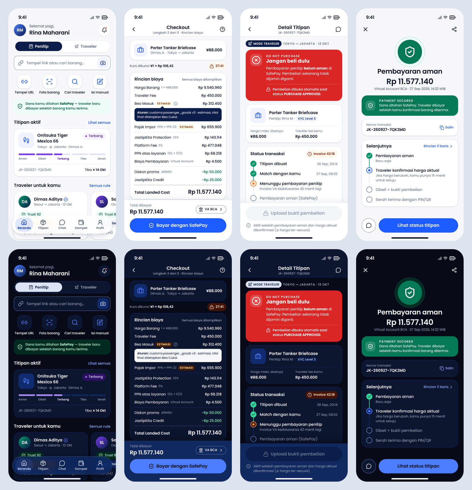

# 05 — UI Design System JastipKita

Status: **v1.0** · Pemilik: Design/Brand · Sumber token: `packages/design-tokens/tokens.json` · Brand: `brand/BRAND-GUIDE.md`
Keterkaitan: `docs/00-domain-model.md` (status, harga, KYC, delivery) **menang** bila terjadi konflik; dokumen ini menerjemahkannya ke UI.

---

## 0. Cara pakai dokumen ini

| Kamu adalah… | Baca |
|---|---|
| Engineer Flutter | §2 platform, §3 token (`JkColors`, `JkTypeScale`, `JkSpacing`, `JkMotion`, `JkGlass`), §5 komponen |
| Engineer web/admin | §3 token (`tokens.css`, `tokens.ts`), §2.3 web, §5 |
| Desainer | §1 prinsip, §4 aksesibilitas, §5–§6 |
| QA | §4 checklist a11y, §5 state tiap komponen, Lampiran A (kontras) |

Token di-build dengan `node packages/design-tokens/scripts/build.mjs` → `dist/tokens.css`, `dist/tokens.ts`, `apps/mobile/lib/core/design/tokens.g.dart`, `CONTRAST.md`. Build **gagal** bila ada pasangan warna teks yang dideklarasikan di bawah WCAG AA.

---

## 1. Prinsip (urut prioritas — bila bertentangan, yang di atas menang)

1. **Trust (kepercayaan)** — pengguna menyerahkan uang ke orang asing di negara lain. Setiap layar transaksi menjawab: *uang saya di mana, siapa yang pegang, apa langkah berikutnya?* Status SafePay selalu terlihat, opak, dan tidak bisa di-dismiss. Tidak ada dark pattern (pre-checked add-on, countdown palsu, "tinggal 1!").
2. **Clarity (kejelasan)** — satu layar, satu tugas utama, satu CTA primer. Istilah domain konsisten (penitip, traveler, titipan, SafePay). Status tidak pernah hanya warna: selalu ikon + label.
3. **Speed (cepat)** — jalur tercepat untuk tugas paling sering: tempel URL → rekomendasi traveler → checkout ≤ 3 layar. Skeleton < 300 ms, optimistic UI hanya untuk aksi non-finansial.
4. **Transparency (keterbukaan)** — **semua** biaya tampil di breakdown 11 baris (§5.5) dengan label *Estimasi* dan sumber aturan. Kurs, masa kunci kurs, dan jendela konfirmasi harga selalu disertai hitung mundur. Integrasi sandbox diberi badge **SANDBOX**.
5. **Accessibility (aksesibilitas)** — WCAG 2.2 AA minimum, dynamic type sampai 200 %, reduce motion, screen reader (VoiceOver/TalkBack), target sentuh 44 pt / 48 dp. Aksesibilitas bukan fitur tambahan: komponen yang gagal checklist §4 tidak boleh di-merge.

---

## 2. Adaptasi platform

Satu sistem token, tiga ekspresi. Brand (warna, tipografi, bentuk simbol, suara) sama; pola interaksi mengikuti platform.

### 2.1 iOS — Apple HIG terbaru (iOS 26, Liquid Glass)

| Aspek | Aturan JastipKita |
|---|---|
| Material | **Liquid Glass hanya di lapisan navigasi & kontrol**: tab bar (kapsul mengambang), toolbar/nav bar yang melayang di atas konten yang di-scroll, kontrol mengambang (tombol kamera di scanner, segmented control overlay). Token: `glass.blurSigma 20`, `saturation 1.8`, `surfaceGlass` (putih 80 % / navy-800 80 %), `glassBorder`; teks & ikon di atas kaca **wajib** `onGlass` / `onGlassMuted` / `onGlassActive` (diuji terhadap kaca di atas latar, konten putih, dan konten hitam). |
| **Larangan glass** | **Tidak pernah** di belakang atau sebagai wadah konten transaksional: PriceBreakdownCard, SafePayStatusBanner, ringkasan checkout, status pembayaran, struk/receipt, form KYC, isi dialog, bubble chat (`glass.forbiddenOn`). Konten ini selalu di `surface`/`surfaceElevated` opak. |
| Layar transaksi | Pada checkout, payment status, purchase gate, dan receipt, nav bar & bottom action bar memakai **permukaan opak** (scroll-edge solid) meski secara teknis "lapisan kontrol" — agar angka uang tidak pernah terlihat buram di balik kaca. |
| Fallback | Reduce Transparency / Increase Contrast aktif → glass diganti `surfaceElevated` opak + border `outline`. |
| Navigasi | Tab bar 5 item (Beranda, Titipan, Chat, Dompet, Profil); large title di root tab; push untuk detail; sheet (`.medium/.large` detents) untuk filter, pemilihan pembayaran, penjelasan Trust Score. |
| Kontrol | Tombol kapsul (`radius.pill`), SF Symbols setara Lucide untuk ikon sistem bila memakai Cupertino widget; haptics `UINotificationFeedbackGenerator` (§4.6). |
| Tipografi | Poppins untuk brand & konten; angka uang tabular. Dynamic Type dipetakan ke `TextScaler` (sampai 2,0×). |

### 2.2 Android — Material 3 Expressive

| Aspek | Pemetaan ke token JastipKita |
|---|---|
| Color scheme | `ColorScheme` dibangun dari `JkColors`: `primary`=navy-900 (dark: navy-100), `secondary`=cobalt-500 (dark: cobalt-400), `surface*`, `error`=red-600, `outline`=slate-450/navy-400. **Dynamic color (Material You) dimatikan** untuk komponen brand & transaksi — warna status harus konsisten lintas perangkat; boleh dipakai hanya untuk ikon launcher themed (monochrome). |
| Bentuk dinamis | Shape scale M3E → `radius`: extra-small 6 (`xs`), small 10 (`sm`), medium 14 (`md`), large 20 (`lg`), extra-large 28 (`xl`), full (`pill`). Tombol & chip: full; kartu: `lg`; bottom sheet: `xl` atas; FAB: `lg`. Morph bentuk (mis. tombol pill → `md` saat ditekan) hanya untuk aksi non-finansial. |
| Motion ekspresif | Spring M3E: `motion.spring.fastSpatial` (1400/0,9) untuk komponen kecil, `defaultSpatial` (700/0,9) untuk transisi layar, `expressiveSpatial` (380/0,8, sedikit overshoot) untuk momen positif (pembayaran aman, titipan diterima). Efek (warna/opacity) memakai `defaultEffects` (tanpa overshoot). **Tidak ada overshoot** pada angka uang atau banner status. |
| Tipografi emphasized | M3 type roles ↔ `typography.scale`: displaySmall↔`display`, headlineLarge/Medium/Small↔`headlineL/M/S`, titleLarge/Medium/Small↔`titleL/M/S`, bodyLarge/Medium/Small↔`bodyL/M/S`, labelLarge/Medium/Small↔`labelL/M/S`. Varian *emphasized* = naik satu bobot (400→500, 600→700) — dipakai untuk total harga, nama traveler terpilih, status aktif. |
| Komponen | Navigation bar (bukan glass; `surface` + tonal elevation), top app bar center-aligned untuk detail, large untuk root; FAB "Buat titipan" (buyer) / "Buat trip" (traveler) — extended FAB menyusut saat scroll. Predictive back didukung. |
| Edge-to-edge | Wajib (Android 15+). Konten di bawah system bar dengan inset; bottom action bar transaksi opak. |

### 2.3 Web (apps/web) & Admin (apps/admin)

- **Responsif, mobile-first**, breakpoint window-class M3: compact < 600, medium 600–839, expanded 840–1199, large 1200–1599, extra-large ≥ 1600 (`breakpoint.*`). Konten maksimal 1200 px; teks bacaan maksimal 720 px.
- Compact: satu kolom + bottom nav. Medium: navigation rail. Expanded+: sidebar + 2 kolom (mis. checkout: detail kiri, ringkasan biaya sticky kanan — kartu opak).
- Glass (`.jk-glass`) hanya untuk header sticky & bottom nav mobile web; fallback otomatis via `@supports` dan `prefers-reduced-transparency`.
- Admin: kepadatan tinggi (tabel 40 px/baris, `bodyS`), tetap memakai token yang sama; badge **SANDBOX** wajib di provider mock/sandbox; angka uang rata kanan + tabular.
- Tema: `data-theme="light|dark"` di `<html>`; tanpa atribut → mengikuti `prefers-color-scheme`.

### 2.4 Light & dark mode

- Keduanya kelas satu; default mengikuti sistem, dapat dipaksa di Pengaturan.
- Dark bukan inversi: latar navy-950 `#070B19`, surface navy-925, elevated navy-800; elevasi diekspresikan dengan permukaan yang lebih terang (bayangan sekunder).
- Warna status di dark memakai tone 200–400 untuk teks/indikator, 950 untuk container; banner SafePay tetap solid (emerald-700 / red-600) di kedua tema.
- Logo: pakai varian `-dark` di atas latar gelap. Gambar produk tidak diberi filter.

### 2.5 Lokalisasi

- Default **Bahasa Indonesia (`id`)**, tambahan **English (`en`)**; semua string di ARB (Flutter) / message catalog (web). Kode, API, token: Inggris.
- Teks Indonesia rata-rata 20–30 % lebih panjang dari Inggris → komponen tidak boleh punya lebar tetap untuk label; tombol boleh 2 baris hanya di ukuran huruf > 130 %.
- Format: `Rp 1.234.567` (id) / `IDR 1,234,567` (en); tanggal "27 Sep 2026, 14:32 WIB"; zona waktu tampil WIB default, ikut locale perangkat bila berbeda (selalu tampilkan singkatan zona).
- Mata uang asing selalu dengan simbol & kode saat ambigu (`¥88.000 (JPY)` di detail pertama).
- Status kritis traveler dwibahasa: "Jangan beli dulu · DO NOT PURCHASE".

---

## 3. Token (ringkasan)

Sumber kebenaran: `packages/design-tokens/tokens.json`. Output: CSS vars `--jk-*`, TS `tokens`, Dart `Jk*`.

### 3.1 Warna semantik

| Token | Light | Dark | Pakai |
|---|---|---|---|
| `background` / `onBackground` | offwhite-50 / ink-900 | navy-950 / offwhite-50 | latar halaman |
| `onBackgroundMuted` | slate-600 | slate-400 | teks sekunder langsung di latar |
| `surface` / `onSurface` | white / ink-900 | navy-925 / offwhite-50 | kartu |
| `surfaceMuted` | slate-50 | navy-900 | field, chip netral, skeleton |
| `surfaceElevated` | white (+elevation) | navy-800 | sheet, dialog, bottom action bar |
| `surfaceGlass` | white 80 % | navy-800 80 % | **hanya** navigasi/kontrol |
| `onGlass` · `onGlassMuted` · `onGlassActive` | ink-900 · slate-600 · cobalt-700 | offwhite-50 · slate-300 · cobalt-200 | teks/ikon di atas kaca (tab bar) |
| `onSurfaceMuted` | slate-500 | slate-400 | teks sekunder di kartu |
| `primary` / `onPrimary` | navy-900 / white | navy-100 / navy-900 | brand, segmented aktif, CTA sekunder |
| `secondary` / `cta` / `onCta` | cobalt-500 / white | cobalt-400 / navy-950 | CTA utama, link, fokus |
| `link` | cobalt-500 | cobalt-300 | tautan teks |
| `border` · `divider` · `outline` | slate-200 · slate-200 · slate-450 | navy-800 · navy-800 · navy-400 | dekoratif · pemisah · batas input (≥ 3:1) |
| `focusRing` | cobalt-500 | cobalt-400 | outline fokus 2 px, offset 2 px |
| `success/warning/error/info` (+`on…`, `…Container`, `on…Container`, `…Text`) | lihat tokens.json | | umpan balik |
| `safepaySecured` / `safepayBlocked` / `safepayPending` | emerald-700 / red-600 / orange-500 | emerald-700 / red-600 / orange-400 | banner SafePay |
| `estimateBadge` | amber-50 / amber-800 | amber-950 / amber-200 | badge "Estimasi" |

**Tone status transaksi** (`color.status.<group>.{fg,bg,dot}`) — pemetaan dari `transactionStatusGroup`:

| Grup | Status | Hue |
|---|---|---|
| `open` | REQUEST_CREATED, MATCHED | cobalt |
| `actionRequired` | AWAITING_PAYMENT, PRICE_CHANGE_PENDING | orange |
| `secured` | PAYMENT_SECURED, PURCHASE_APPROVED | emerald |
| `inTransit` | PURCHASED, TRAVELING, ARRIVED, CUSTOMS_PROCESS, READY_FOR_HANDOVER, OUT_FOR_DELIVERY | violet |
| `delivered` | DELIVERED, BUYER_CONFIRMED | teal |
| `completed` | COMPLETED | emerald gelap |
| `disputed` | DISPUTED | red |
| `refund` | REFUND_PENDING | sky |
| `closed` | REFUNDED, CANCELLED | slate |

**Trust tier** (`trust.low 0–39` red · `fair 40–69` orange · `good 70–84` cobalt · `excellent 85–100` emerald). **KYC** (`kyc.level1` slate · `level2` sky · `level3` cobalt · `level4` navy · `level5` amber/"gold").

### 3.2 Tipografi (Poppins)

| Token | Ukuran/leading | Bobot | Tracking | Pakai |
|---|---|---|---|---|
| `display` | 40/48 | 700 | −2 % | hero onboarding, angka besar sukses |
| `headlineL/M/S` | 32/40 · 28/36 · 24/32 | 600 | −1,5 … −0,5 % | judul layar |
| `titleL/M/S` | 20/28 · 18/26 · 16/24 | 600 | 0 | app bar, judul kartu, nama |
| `bodyL/M/S` | 16/24 · 14/22 · 12/18 | 400 | 0 … +1 % | isi |
| `labelL/M/S` | 14/20 · 12/16 · 11/16 | 500 | +0,5 … +4 % | tombol, chip, caption, overline |
| `moneyL/M/S` | 28/36 · 18/26 · 14/20 | 600/600/500 | tabular (`tnum`) | nominal |

Line-height sebagai rasio (CSS unitless, Flutter `height`) + `TextLeadingDistribution.even` agar teks tetap di tengah saat diskalakan.

### 3.3 Spasi, radius, elevasi, motion, glass

- **Spasi** grid 4-pt: `0, 2, 4, 8, 12, 16, 20, 24, 32, 40, 48, 64, 80`. Margin layar 20 (compact), 24 (medium), 32 (expanded). Jarak antar kartu 12, antar section 20–24.
- **Radius**: xs 6 (badge Estimasi) · sm 10 (tooltip, thumbnail kecil) · md 14 (input, thumbnail) · lg 20 (kartu, banner) · xl 28 (sheet, dialog) · pill 999 (tombol, chip, tab bar).
- **Elevasi** `level0–4` (light: bayangan navy lembut; dark: permukaan lebih terang + bayangan hitam). Kartu = level1, menu = level2, tab bar/FAB = level3, dialog = level4.
- **Motion**: `fast 120` (hover, press, chip), `base 200` (expand, tab switch), `slow 300` (sheet, page), `emphasized 450` (momen sukses). Easing `standard (0.2,0,0,1)`, `emphasizedDecelerate (0.05,0.7,0.1,1)` masuk, `emphasizedAccelerate (0.3,0,0.8,0.15)` keluar.
- **Reduce motion** (wajib): bila OS meminta, semua transisi spasial (slide, scale, shared-axis, parallax, overshoot spring) diganti cross-fade ≤ 120 ms; animasi loop/konfeti/pulse countdown mati; progress indicator tetap tanpa bounce. CSS menurunkan `--jk-duration-*` otomatis; Flutter cek `MediaQuery.disableAnimationsOf(context)`.
- **Glass**: σ 20, saturasi 1,8, opacity 0,80 (light & dark), border 0,5 px — lihat §2.1 untuk batas pakai.
- **Target sentuh**: iOS 44 pt, Android 48 dp, web 44 px, jarak antar target ≥ 8.

---

## 4. Aksesibilitas (checklist wajib per komponen)

1. **Kontras** — teks ≥ 4,5:1, teks besar/ikon/batas input/fokus ≥ 3:1. Semua pasangan token terverifikasi (Lampiran A). Warna custom di luar token dilarang.
2. **Semantik** — setiap elemen interaktif punya label, role, dan state. Flutter: `Semantics(label:, button:, selected:, liveRegion:)`; web: elemen native / ARIA. Ikon-saja wajib punya label ("Notifikasi, 3 baru").
   - Uang dibacakan lengkap: "Total, sebelas juta lima ratus tujuh puluh tujuh ribu seratus empat puluh rupiah" (bukan "Rp 11.577.140" dieja).
   - Badge Estimasi dibacakan: "Bea masuk, estimasi, …".
   - Banner SafePay: blocked = `liveRegion`/`role="alert"`; secured = `role="status"`.
3. **Urutan fokus** — mengikuti urutan visual: judul → status → konten → aksi primer. Bottom action bar di akhir urutan. Setelah navigasi, fokus ke judul layar; setelah error form, fokus ke field error pertama.
4. **Dynamic type ≤ 200 %** — tidak ada tinggi tetap pada wadah teks; baris breakdown membungkus nilai ke baris kedua (label di atas, nominal rata kanan di bawah) saat > 130 %; tab bar menampilkan label di bawah ikon atau hanya ikon + tooltip besar (iOS Large Content Viewer) di > 150 %.
5. **Reduce motion & transparency** — lihat §3.3 dan §2.1.
6. **Haptics** (iOS/Android, bisa dimatikan di Pengaturan):
   | Momen | iOS | Android |
   |---|---|---|
   | Pembayaran aman / titipan diterima | `.success` notification | `CONFIRM` |
   | DO NOT PURCHASE tampil / PIN salah | `.error` notification | `REJECT` |
   | Kurs tinggal 60 detik | `.warning` | `CLOCK_TICK` (sekali) |
   | Toggle, pilih chip | selection | `SEGMENT_TICK` |
   Haptic tidak pernah jadi satu-satunya penanda.
7. **Tidak bergantung warna** — status = ikon + teks + warna. Grafik memakai pola/label.
8. **Waktu** — countdown bisa di-*extend* bila aturan domain mengizinkan (mis. minta kurs baru), dan tidak memaksa aksi tanpa peringatan 60 detik sebelumnya.
9. **Input** — label selalu terlihat (bukan hanya placeholder), error di bawah field dengan ikon + teks, `autofill` untuk OTP/telepon/nama.

---

## 5. Katalog komponen

Format: **Tujuan · Anatomi · Varian · State · Token · A11y**. Nama komponen = nama widget Flutter (`Jk…`) dan komponen web.

### 5.1 AppBar & TabBar

- **Tujuan**: navigasi global & konteks layar.
- **Anatomi AppBar**: leading (back/close, 44×44) · judul (`titleM`, center iOS / start Android) + subjudul opsional (`labelM`, mis. nomor transaksi) · aksi trailing ≤ 2 ikon.
- **Varian AppBar**: `standard` (opak `surface`), `large` (root tab, judul `headlineM` collapse saat scroll), `glass` (iOS, melayang di atas konten non-transaksional — beranda, eksplorasi traveler), `transactional` (opak + divider; wajib di checkout, payment, purchase gate, receipt, dispute).
- **TabBar (buyer)**: Beranda · Titipan · Chat · Dompet · Profil. **(traveler)**: Beranda · Trip · Pesanan · Chat · Profil.
  - iOS: kapsul glass mengambang (inset 14, tinggi 66, radius pill, `elevation.level3`, `glassBorder`), item aktif = ikon + label `onGlassActive` (cobalt-700 / cobalt-200, 600) + pill tint cobalt 14 %; item non-aktif `onGlassMuted`; label `labelS` 11 px.
  - Android: NavigationBar M3 opak (`surface` + tonal), indikator pill `secondaryContainer`.
- **State**: default, scrolled-under (glass lebih pekat / divider muncul), badge count (dot `error` + angka `labelS`), disabled item (tidak dipakai — sembunyikan saja).
- **A11y**: tab = `role=tab`, `selected`; badge dibacakan ("Chat, 2 pesan baru").

### 5.2 Tombol

| Varian | Isi | Pakai | Token |
|---|---|---|---|
| Primary | `cta` / `onCta` | satu per layar: "Bayar dengan SafePay", "Kirim titipan" | tinggi 52 (48 web), pill, `labelL` 16/600 |
| Secondary | `surface` + border `outline` / `onSurface` | alternatif: "Chat traveler" | |
| Tertiary (text) | transparan / `link` | "Lihat rincian", "Lewati" | tinggi min 44 |
| Tonal | `secondaryContainer` / `onSecondaryContainer` | aksi pendukung di kartu | |
| Destructive | `error` / `onError` (atau outline `errorText`) | "Batalkan titipan", "Laporkan" — selalu dengan dialog konfirmasi | |

- **State**: default · hover (overlay `onX` 8 %) · pressed (12 %, `ctaPressed`) · focused (ring 2 px `focusRing`, offset 2) · loading (spinner menggantikan ikon, label tetap, tombol non-interaktif, `aria-busy`) · disabled (`disabledContainer`/`disabledContent`, **selalu** disertai alasan di bawahnya bila terkait aturan, mis. purchase gate).
- **Aturan uang**: tombol yang memindahkan uang menampilkan nominal ("Bayar Rp 11.577.140") atau berada tepat di bawah total; idempotency di sisi API, tapi UI juga mengunci tombol setelah tap pertama.

### 5.3 TextField

- **Anatomi**: label (`labelL`, selalu terlihat) · field (tinggi 52, `radius.md`, `surface`, border 1 px `outline`) · prefix (ikon/`Rp`/kode negara) · input (`bodyL`) · suffix (clear, kamera, show-password) · helper/error (`bodyS`) · counter opsional.
- **Varian**: text, money (prefix mata uang, keyboard numerik, format ribuan live, tabular), URL (paste chip otomatis dari clipboard dengan izin), OTP (6 kotak, autofill SMS), phone (+62 default), search (pill, ikon kiri).
- **State**: empty · focused (border 2 px `focusRing`) · filled · error (border `error`, ikon + pesan `errorText`) · disabled · read-only (tanpa border, `surfaceMuted`).

### 5.4 Money display

- **Anatomi**: simbol/kode mata uang · angka tabular · (opsional) nilai asal ("¥88.000") · (opsional) badge Estimasi.
- **Ukuran**: `moneyL` (total checkout/sukses), `moneyM` (total kartu), `moneyS` (baris breakdown/list).
- **Aturan**: integer minor unit dari API → diformat di klien per `currencies.minor_units` (IDR 0 desimal); negatif pakai minus sejati "−Rp 50.000" warna `successText` (potongan menguntungkan penitip); konversi selalu menyebut kurs & waktu kunci; tidak ada pembulatan diam-diam — pembulatan half-up sesuai domain.
- **A11y**: dibacakan sebagai kalimat lengkap (lihat §4.2).

### 5.5 PriceBreakdownCard ★

Kartu opak (`surface`, `radius.lg`, level1) — **tidak pernah glass**. Urutan baris **tetap** sesuai `docs/00-domain-model.md §10`:

| # | Kode | Label (id) | Catatan tampilan |
|---|---|---|---|
| 1 | `ITEM_PRICE` | Harga Barang | sub-label `qty × harga asal` (mis. "1 × ¥88.000"); di bawah kartu: baris kurs terkunci + **CountdownChip** FX |
| 2 | `TRAVELER_FEE` | Traveler Fee | nama traveler di tooltip |
| 3 | `CUSTOMS_DUTY` | Bea Masuk | badge **Estimasi** bila `isEstimate`; ikon ⓘ → tooltip sumber aturan |
| 4 | `IMPORT_TAX` | Pajak Impor | sub-label "PPN + PPh 22"; badge **Estimasi** |
| 5 | `PROTECTION_FEE` | JastipKita Protection | sub-label rate ("1,5 %"); tap → sheet cakupan perlindungan |
| 6 | `PLATFORM_FEE` | Platform Fee | sub-label rate |
| 7 | `SERVICE_TAX` | PPN atas layanan | sub-label basis ("12 % × 11/12"); hanya bila berlaku |
| 8 | `PAYMENT_FEE` | Biaya Pembayaran | sub-label channel ("Virtual Account"); berubah live saat channel diganti |
| 9 | `DISCOUNT` | Diskon promo | kode promo; nilai negatif `successText` |
| 10 | `REFERRAL_CREDIT` | JastipKita Credit | nilai negatif `successText` |
| 11 | `TOTAL` | Total Landed Cost | pemisah garis putus `outline`; `titleS` + `moneyM`/`moneyL` |

- **Aturan tampil**: baris biaya 1–8 **selalu tampil** bila berlaku di transaksi — termasuk bernilai 0 dengan alasan ("Rp 0 · dibebaskan"); baris 9–10 hanya bila ada potongan; header menyatakan "Semua biaya ditampilkan". Kelompok visual: barang & bea (1–4) · layanan JastipKita (5–8) · potongan (9–10) · total — dipisah `divider`.
- **Tooltip sumber aturan** (`ruleRef`): tap/hover ⓘ → bubble `surfaceInverse` berisi id aturan + versi + tanggal berlaku + kalimat "Estimasi — nilai final ditetapkan Bea Cukai". Di layar pembaca: tombol "Info aturan bea masuk".
- **State**: loading (skeleton 11 baris), quote aktif, quote kedaluwarsa (kartu diberi overlay `warningContainer` "Harga perlu diperbarui" + tombol "Perbarui kurs"; CTA bayar disabled), perubahan harga (baris yang berubah disorot 1× `warningContainer` fade 1 s — reduce motion: tanpa fade), mode ringkas (collapsed: hanya total + "Rincian 11 baris ›").
- **Dynamic type**: > 130 % → label dan nominal bertumpuk.
- Mockup: `docs/design/mockups/checkout-breakdown-{light,dark}.png`.

### 5.6 SafePayStatusBanner ★

**Opak, solid, tidak bisa di-dismiss, tidak pernah glass.** Ikon + overline dwibahasa + judul + penjelasan + aturan.

| Varian | Kapan | Isi | Token |
|---|---|---|---|
| `secured` (buyer) | status ≥ PAYMENT_SECURED (belum terminal) | overline "PAYMENT SECURED", judul "Pembayaran aman", "Dana ditahan SafePay. Traveler dibayar setelah kamu konfirmasi barang diterima." | `safepaySecured` emerald-700 / white (5,48:1) |
| `approved` (traveler) | PURCHASE_APPROVED | "PURCHASE APPROVED — Boleh beli", harga maksimum disetujui | `safepaySecured` |
| `blocked` (traveler) | **semua status sebelum PURCHASE_APPROVED** (REQUEST_CREATED, MATCHED, AWAITING_PAYMENT, PAYMENT_SECURED, PRICE_CHANGE_PENDING) | "DO NOT PURCHASE — Jangan beli dulu" + alasan spesifik status (belum dibayar / menunggu konfirmasi harga / menunggu persetujuan penitip) + "Pembelian dibuka otomatis saat status PURCHASE APPROVED." | `safepayBlocked` red-600 / white (4,83:1) |
| `pending` (buyer) | AWAITING_PAYMENT | "Menunggu pembayaran" + CountdownChip invoice | `safepayPending` orange-500 / ink-900 (6,37:1) |

- Posisi: tepat di bawah app bar, sebelum konten apa pun; sticky pada layar detail traveler.
- **A11y**: `blocked` = live region assertive + haptic error sekali saat pertama tampil; `secured` = polite. Ikon octagon-x / shield-check tidak pernah satu-satunya penanda.
- Mockup: `traveler-do-not-purchase-*.png`, `payment-secured-*.png`.

### 5.7 StatusTimeline

- **Anatomi**: node (22 px) + garis penghubung 2 px · label (`labelL`/`bodyM`) · meta (waktu WIB, aktor, catatan) · aksi kontekstual opsional.
- **State node**: `done` (isi `success`, centang), `current` (ring `warning` bila menunggu aksi pengguna, ring `secondary` bila menunggu pihak lain), `upcoming` (ring `outline`), `error` (isi `error`, untuk DISPUTED/CANCELLED), `skipped` (garis putus, mis. CUSTOMS_PROCESS dilewati).
- **Pemetaan**: 19 status domain diringkas jadi langkah ramah pengguna — Buyer: *Titipan dibuat → Match → Bayar → Pembayaran aman → Konfirmasi harga → Dibeli → Perjalanan → Tiba/Bea cukai → Serah terima → Selesai*. Traveler memakai label sudut pandang traveler. Grup warna = `transactionStatusGroup`.
- **Varian**: vertikal (detail), horizontal ringkas 5 segmen (kartu di beranda — lihat mockup buyer home), riwayat audit (admin: semua `transaction_events` mentah).
- **A11y**: list berurutan; node current dibacakan "Langkah 3 dari 10, sedang berlangsung".

### 5.8 CountdownChip

- **Pakai**: FX lock (`fx.lock.lockMinutes` 30), jendela konfirmasi harga (900 s), invoice kedaluwarsa, TTL QR serah terima (30 min).
- **Anatomi**: ikon (lock/clock) · waktu `mm:ss` tabular · label opsional ("Kurs", "Invoice").
- **State**: > 5 min `infoContainer` · ≤ 5 min `warningContainer` · ≤ 60 s `errorContainer` + haptic warning sekali · habis → berubah jadi tombol "Perbarui" / status kedaluwarsa (tidak pernah hilang diam-diam).
- **Sumber waktu**: `expiresAt` dari server; klien hanya menghitung mundur (koreksi drift saat resume).
- **A11y**: live region polite hanya pada ambang (5 min, 1 min, habis), bukan tiap detik. Reduce motion: tanpa pulse.

### 5.9 TrustScoreBadge

- Chip `Trust 92` + ikon shield, warna tone tier (`trust.*`); varian `compact` (angka saja), `full` (angka + label tier: "Rendah / Cukup / Baik / Sangat tepercaya"), `detail` (ring progress 0–100 di profil).
- Tap → sheet "Cara Trust Score dihitung" (komponen & bobot `trust.weights`, tanpa membuka data sensitif pihak lain).
- Override admin ditandai ikon kecil + tooltip "Disesuaikan tim JastipKita" (transparansi).

### 5.10 KycLevelBadge

| Level | Kode | Label (id) | Tone |
|---|---|---|---|
| 1 | REGISTERED | Terdaftar | `kyc.level1` slate |
| 2 | PHONE_VERIFIED | HP terverifikasi | `kyc.level2` sky |
| 3 | IDENTITY_VERIFIED | Identitas terverifikasi | `kyc.level3` cobalt |
| 4 | TRAVELER_VERIFIED | Traveler terverifikasi | `kyc.level4` navy |
| 5 | TRUSTED_TRAVELER | Trusted Traveler | `kyc.level5` amber (ikon award) |

Level 5 dapat dicabut otomatis → badge hilang tanpa notifikasi publik; pemilik akun mendapat penjelasan.

### 5.11 TripCard (traveler & publik)

Anatomi: rute (kota + kode negara) → panah pesawat · tanggal berangkat–tiba (WIB) · badge **Trip terverifikasi** (dokumen perjalanan diverifikasi) · sisa kapasitas (kg / item) dengan progress bar · status trip (DRAFT … COMPLETED) · kategori yang diterima · CTA ("Kelola", "Titip ke trip ini"). State: draft (border putus), verification pending (chip `actionRequired`), full (kapasitas 100 %, CTA nonaktif + alasan), cancelled.

### 5.12 RequestCard (titipan)

Thumbnail produk (radius md; placeholder ikon kategori) · nama produk (2 baris maks) · toko/URL domain · harga asal + estimasi total · negara asal · jumlah penawaran · status chip · RestrictedItemWarning ringkas bila bukan ALLOWED. Varian buyer (progress 5 segmen) dan traveler (fee yang ditawarkan, deadline).

### 5.13 OfferCard

Traveler (avatar, nama, TrustScoreBadge, KycLevelBadge) · fee traveler · estimasi tiba · pesan singkat · CTA "Terima penawaran" (primary) / "Chat" · masa berlaku penawaran (CountdownChip). Offer yang lebih murah tapi trust rendah **tidak** di-highlight sebagai "terbaik" — ranking memakai `matching.weights`, label "Direkomendasikan" menjelaskan alasannya.

### 5.14 TravelerCard

Avatar (inisial bila tanpa foto) + centang verifikasi · nama · rute & tanggal · rating ★ 4,9 (jumlah ulasan) · TrustScoreBadge · KycLevelBadge (Trusted Traveler) · badge Trip terverifikasi · sisa kapasitas · fee mulai. Lebar 268 di carousel, penuh di list. Lihat mockup buyer home.

### 5.15 RestrictedItemWarning

| Klasifikasi | Tampilan | Aksi wajib |
|---|---|---|
| `ALLOWED` | tidak ada banner (opsional chip "Diizinkan" `successContainer`) | — |
| `RESTRICTED` | banner `warningContainer` + ikon alert-triangle | checkbox acknowledgement sebelum bayar |
| `DECLARATION_REQUIRED` | banner `infoContainer` + ikon file-text: "Wajib dideklarasikan ke Bea Cukai" | acknowledgement |
| `PERMIT_REQUIRED` | banner `warningContainer` border tebal + ikon file-badge: "Butuh izin (mis. BPOM/Postel)" | acknowledgement + upload/nomor izin bila diminta |
| `PROHIBITED` | banner solid `error` + ikon ban: "Barang terlarang — tidak bisa dititipkan" | checkout **diblokir**; tampilkan alasan & alternatif |

Teks menjelaskan dampak (denda, penyitaan) dengan bahasa netral; tautan "Kenapa?" ke aturan versi terkait. Acknowledgement dicatat (bukan sekadar UI).

### 5.16 DeliveryPin / QR display

- PIN 6 digit sekali pakai, ditampilkan `display` tabular, dikelompokkan 3-3 ("482 915"), tombol "Tampilkan QR".
- QR token (TTL 30 min, CountdownChip), kecerahan layar dinaikkan otomatis, `FLAG_SECURE`/deteksi screenshot → peringatan.
- Peringatan tetap: "Periksa barang dulu. Jangan berikan PIN sebelum barang sesuai." Maks 5 percobaan (sisa percobaan tampil setelah salah pertama, haptic error).
- Sisi traveler: field PIN (OTP style) + scanner QR (kontrol mengambang boleh glass; kotak scan tidak).
- Metode COURIER/PARTNER_LOGISTICS: tampilkan nomor resi + tracking, bukan PIN.

### 5.17 ChatBubble

| Tipe | Anatomi |
|---|---|
| text | bubble `radius.lg` dengan satu sudut 6; milik sendiri `secondaryContainer`, lawan `surface` + border; waktu + status kirim (`labelS`) |
| image | thumbnail radius md, tap → viewer; caption opsional |
| product | kartu mini: thumbnail, nama, harga asal, link toko (dibuka in-app browser) |
| receipt | kartu bukti pembelian: merchant, total, waktu, foto struk; badge "Bukti pembelian" — bukan glass |
| system | pill tengah `surfaceMuted` `labelM`: perubahan status ("Pembayaran aman · 14:32") |

Anti-fraud: deteksi kata kunci transfer di luar platform → banner inline `warningContainer` "Jangan bayar di luar SafePay. Transaksi di luar aplikasi tidak dilindungi." Tidak ada nomor rekening di chat (di-mask).

### 5.18 EmptyState

Ilustrasi/ikon (simbol orbit tipis, 96 px, `onSurfaceMuted`) · judul `titleM` · deskripsi `bodyM` (maks 2 baris) · 1 CTA. Contoh: "Belum ada titipan — Tempel link produk pertama kamu". Error state memakai pola sama dengan ikon `error` + "Coba lagi".

### 5.19 Skeleton

Blok `surfaceMuted` dengan radius komponen asli; shimmer linear 1,2 s (reduce motion: statis, tanpa shimmer). Tampil bila loading > 300 ms; maksimal 10 s lalu ganti ke error state. Skeleton angka uang tidak menampilkan "Rp 0".

### 5.20 Toast / Snackbar

Bawah layar di atas tab bar, `surfaceInverse`/`onSurfaceInverse`, `radius.md`, maks 2 baris + 1 aksi ("Urungkan"). Durasi 4 s (8 s bila ada aksi; tidak auto-hilang bila pembaca layar aktif sampai difokus). **Tidak** untuk informasi finansial kritis — itu harus banner/dialog.

### 5.21 BottomSheet

`surfaceElevated`, radius atas `xl` 28, handle 36×4, scrim `scrim`. Detents: medium (50 %) & large. Untuk: pilih metode bayar, filter, penjelasan Trust Score, detail aturan. Isi sheet yang transaksional tetap opak (sheet boleh punya header glass di iOS hanya bila tidak memuat angka).

### 5.22 Dialog

`surfaceElevated`, radius xl, maks lebar 400, judul `titleL`, isi `bodyM`, aksi kanan-bawah (Android) / bertumpuk (iOS). Wajib untuk: batal transaksi (tampilkan refund & penalti dari cancellation matrix), setujui/tolak perubahan harga, buka dispute, keluar dari KYC di tengah jalan. Aksi destruktif memakai warna `error` dan label kata kerja spesifik ("Batalkan titipan", bukan "OK").

### 5.23 Stepper KYC

Horizontal 4 langkah (Nomor HP → Identitas (KTP/Paspor) → Selfie & liveness → Rekening payout [traveler]) dengan KycLevelBadge target. State langkah: done/current/upcoming/rejected (alasan penolakan + "Coba lagi"). Setiap langkah menjelaskan **kenapa** data diminta dan bagaimana disimpan ("Dienkripsi, hanya untuk verifikasi"). Kamera dokumen: bingkai panduan, deteksi blur/silau, tanpa glass di area tangkap.

---

## 6. Blueprint layar kunci (wireframe-level)

Notasi: `[AppBar]` · `{Konten}` · `(Aksi)` · ★ = aturan domain kritis.

### 6.1 Onboarding & Auth
`[tanpa app bar]` → carousel 3 layar (ilustrasi + `display` singkat: "Titip belanja dari luar negeri", "Traveler terverifikasi", "Dana aman di SafePay") → `(Masuk dengan Google)` `(Masuk dengan Apple)` `(Email / Nomor HP)` → OTP 6 digit (autofill) → nama → pilih mode awal (Penitip/Traveler, bisa diganti kapan saja) → izin notifikasi (dengan alasan). Link Syarat & Kebijakan Privasi di bawah tombol. Level 1 setelah daftar; OTP HP → level 2.

### 6.2 Beranda (buyer & traveler + mode switch)
Mockup: `buyer-home-*.png`.
- **Buyer**: sapaan + lonceng · **segmented mode switch** (Penitip | Traveler; beralih = perubahan tab bar & beranda, `users.active_mode`) · field "Tempel link atau cari barang" + tombol kamera · 4 aksi cepat (URL, Foto, Cari traveler, Manual) · strip SafePay (edukasi, `successContainer`) · Titipan aktif (RequestCard + progress 5 segmen) · Traveler untuk kamu (carousel TravelerCard) · tab bar glass.
- **Traveler**: status KYC (bila < level 3: kartu "Lengkapi verifikasi untuk menerima titipan") · Trip aktif (TripCard + kapasitas) · Pesanan yang harus ditindak (sorted by deadline; setiap item dengan SafePayStatusBanner mini: merah/hijau) · Request cocok dengan rute · FAB "Buat trip".
- Mode switch ke Traveler tanpa KYC ≥ 3 diperbolehkan untuk melihat, tapi aksi menerima diblokir dengan penjelasan.

### 6.3 Buat titipan (URL / foto / cari / manual)
Satu layar dengan tab sumber: **URL** (paste → ekstraksi AI [label SANDBOX bila mock] → pratinjau produk: foto, nama, harga asal, varian; field yang tidak yakin ditandai "periksa") · **Foto** (kamera/galeri → pencarian visual; hasil harus dikonfirmasi) · **Cari** (katalog/riwayat) · **Manual** (nama, toko, negara, harga, qty, varian, catatan). Setelah itu: RestrictedItemWarning (★ PROHIBITED memblokir) → estimasi landed cost (breakdown ringkas, label Estimasi) → negara/kota tujuan → `(Simpan & cari traveler)`. Draft tersimpan otomatis (level 1 boleh draft).

### 6.4 Detail titipan & traveler rekomendasi
`[AppBar: Titipan · nomor]` → kartu produk → status chip + StatusTimeline ringkas → "Traveler rekomendasi" (list TravelerCard/OfferCard, urut `matching.weights`, label alasan: "Rute persis · tiba 12 Okt · Trust 92") → filter (tanggal, trust, fee) di sheet → `(Terima penawaran)` → konfirmasi match.

### 6.5 Checkout dengan breakdown transparan ★
Mockup: `checkout-breakdown-*.png`. `[AppBar transactional: Checkout · Langkah 2 dari 3]` → ringkasan item + traveler → baris kurs terkunci + CountdownChip → **PriceBreakdownCard 11 baris** → acknowledgement barang terbatas (bila perlu) → metode bayar (sheet; biaya baris 8 berubah live) → catatan SafePay → `[Bottom bar opak: Total + (Bayar dengan SafePay)]`. Guard: KYC ≥ 2 (bila belum → alur OTP inline), quote & FX lock aktif (bila habis → "Perbarui kurs", CTA disabled).

### 6.6 Status pembayaran
- **Menunggu**: SafePayStatusBanner `pending` + instruksi VA/QRIS (nomor VA besar tabular + salin, QR), CountdownChip invoice, "Cek status" (polling + webhook), cara bayar per bank (accordion).
- **Aman**: mockup `payment-secured-*.png` — medali shield, "Pembayaran aman", total `moneyL`, channel & waktu WIB, banner `secured`, nomor transaksi + salin, timeline "Selanjutnya", `(Lihat status titipan)` + chat. Haptic success, spring expressive (reduce motion: fade).
- **Gagal/kedaluwarsa**: banner `errorContainer`, alasan, `(Bayar ulang)` — status kembali MATCHED sesuai domain.

### 6.7 Konfirmasi perubahan harga ★
Dipicu PRICE_CHANGE_PENDING. `[Sheet/layar penuh]` → CountdownChip 15:00 (window 900 s; expired = reject) → perbandingan "Harga ter-secure vs Harga aktual" (selisih berwarna, persentase) → foto bukti harga dari traveler → breakdown baru (baris yang berubah disorot) → bila perlu dana tambahan: "Kamu perlu membayar tambahan Rp X" → `(Setujui)` `(Tanya traveler)` [CLARIFICATION_REQUESTED] `(Tolak & refund)` dengan dialog dampak.

### 6.8 Buat trip & verifikasi (traveler)
Stepper: rute (asal → tujuan, transit) → tanggal & jam (zona lokal + WIB) → kapasitas (kg, jumlah item, kategori diterima/ditolak) → fee default → upload dokumen perjalanan (tiket/boarding pass; data sensitif di-mask) → review → status VERIFICATION_PENDING (TripCard dengan chip oranye) → VERIFIED (badge). Info: trip tanpa dokumen tidak bisa ACTIVE (config default).

### 6.9 Gate "Do Not Purchase" (traveler) ★
Mockup: `traveler-do-not-purchase-*.png`. `[AppBar transactional: Detail Titipan · nomor]` → konteks mode traveler + rute → **SafePayStatusBanner `blocked`** (sticky) → kartu permintaan (harga maks disetujui, fee) → StatusTimeline (current = menunggu pembayaran/konfirmasi) → `[Bottom bar: (Upload bukti pembelian) DISABLED + alasan]`. Saat PAYMENT_SECURED: banner tetap merah, aksi yang aktif = `(Konfirmasi harga aktual)`. Saat PURCHASE_APPROVED: banner berubah hijau `approved`, haptic success, tombol pembelian/bukti aktif.

### 6.10 Upload bukti pembelian
Checklist wajib (dari domain): foto struk, foto barang, merchant, harga aktual, waktu pembelian, serial/video bila kategori mewajibkan → validasi harga ≤ approved (bila lebih: arahkan ke alur perubahan harga, bukan submit) → pratinjau → `(Kirim bukti)` → status PURCHASED. Kamera: bingkai struk, deteksi blur; unggahan resumable dengan progress per file.

### 6.11 Serah terima (PIN/QR)
Buyer: kartu DeliveryPin/QR + peringatan "periksa barang dulu" + checklist kondisi. Traveler: input PIN / scan QR (kontrol scan boleh glass mengambang) + sisa percobaan → sukses DELIVERED (haptic success) → buyer diminta konfirmasi (auto-confirm 48 jam, ditampilkan sebagai countdown). Metode kurir: nomor resi + tracking.

### 6.12 Dispute center
List dispute (DSP-…) dengan status OPEN → EVIDENCE_COLLECTION → UNDER_REVIEW → RESOLVED → (APPEALED) → CLOSED (StatusTimeline + SLA countdown dari `dispute.sla`). Buka dispute: pilih tipe (7 tipe domain) → deskripsi → bukti (foto/video/chat) → resolusi yang diminta (REFUND_FULL, PARTIAL, …) → ringkasan dampak dana → kirim. Tampilan opak seluruhnya; hasil resolusi menampilkan rincian refund per bucket.

### 6.13 Alur KYC
Stepper KYC (§5.23). Level saat ini + manfaat level berikutnya (limit transaksi `limits.transaction.byKycLevel` ditampilkan jujur: "Level 3: hingga Rp 15 juta/transaksi"). Pending review: estimasi waktu, notifikasi saat selesai. Ditolak: alasan spesifik + cara memperbaiki.

### 6.14 Dompet, credit & referral
Saldo JastipKita Credit (tidak bisa ditarik — nyatakan jelas) + tanggal kedaluwarsa per batch · riwayat (masuk/keluar, tabular, rata kanan) · traveler: pendapatan tertahan vs siap dibayar + jadwal payout (rekening di-mask `****0961`) · referral: kode + share sheet, syarat ("teman menyelesaikan transaksi pertama ≥ Rp 500.000"), progres batas bulanan, status tiap undangan. Tanpa gamifikasi menyesatkan.

### 6.15 Profil & pengaturan
Header profil (avatar, nama, KycLevelBadge, TrustScoreBadge, rating) · Mode aktif · Verifikasi · Rekening payout (traveler) · Alamat · Bahasa (Indonesia/English) · Tema (Sistem/Terang/Gelap) · Notifikasi (per kategori) · Haptics on/off · Keamanan (perangkat login, PIN aplikasi/biometrik) · Bantuan (TKT-…) · Syarat, Privasi, Lisensi (termasuk OFL Poppins) · Keluar / Hapus akun (dialog dengan dampak).

---

## 7. Mockup hi-fi

Sumber HTML memakai token asli (`docs/design/mockups/src/*.html` → `tokens.css` + Poppins); render ulang: `node brand/scripts/render-mockups.mjs` (390 × 844 @2x, light + dark).

| Layar | Light | Dark | Yang ditunjukkan |
|---|---|---|---|
| Beranda penitip | `design/mockups/buyer-home-light.png` | `…-dark.png` | mode switch, tab bar **glass** di atas konten non-transaksional, TravelerCard, trust & KYC badge |
| Checkout | `design/mockups/checkout-breakdown-light.png` | `…-dark.png` | 11 baris breakdown, badge Estimasi, tooltip sumber aturan, CountdownChip kurs, bottom bar **opak** |
| Gate traveler | `design/mockups/traveler-do-not-purchase-light.png` | `…-dark.png` | banner DO NOT PURCHASE solid, timeline, CTA disabled + alasan |
| Pembayaran aman | `design/mockups/payment-secured-light.png` | `…-dark.png` | banner PAYMENT SECURED, total tabular, langkah selanjutnya |

Angka di mockup adalah contoh ilustratif yang konsisten secara aritmetika dengan `business-config.defaults.json` (platform fee 5 %, protection 1,5 %, PPN layanan 12 % × 11/12, VA Rp 4.500); bea masuk & pajak impor adalah angka contoh, bukan hasil engine.

---

## Lampiran A — Laporan kontras WCAG (output `build.mjs`)

Ringkasan saat dokumen ini ditulis: **light 84/84, dark 84/84 pasangan wajib lolos AA** (terendah: light 3,01:1 `outline` di atas `background` — batas input, syarat 3:1; dark 3,14:1 `outline` di atas `surfaceElevated`). Versi terbaru selalu di `packages/design-tokens/CONTRAST.md`; build gagal bila ada regresi.

Temuan yang memengaruhi desain (lihat juga Brand Guide §2):
- slate-500 di atas off-white 4,48:1 → teks sekunder langsung di latar memakai `onBackgroundMuted` (slate-600, 7,14:1).
- Putih di atas emerald-600 3,77:1 → banner PAYMENT SECURED memakai emerald-700 (5,48:1).
- Putih di atas orange-500 2,80:1 → isi oranye memakai teks ink-900 (6,37:1); ikon/teks peringatan di permukaan memakai `warningText` orange-700 (5,18:1).
- Dark mode: label CTA di atas cobalt-400 memakai navy-950 (5,32:1), bukan putih (3,69:1).
- Glass: versi awal (putih 72 % / navy-800 62 %) gagal untuk teks sekunder & ikon aktif bila di belakangnya konten hitam/putih ekstrem (terendah 2,03:1). Perbaikan: opacity 80 % di kedua tema + token khusus `onGlass*` — kini terendah 4,72:1 (teks) di semua kondisi.

<!-- CONTRAST-REPORT:START -->
Generated by `node packages/design-tokens/scripts/build.mjs` from `tokens.json`. Thresholds: **text 4.5:1** (AA normal text), **ui 3:1** (AA non-text: focus rings, input outlines, indicator icons). Translucent colours are composited over their background before measuring. Rows marked *advisory* are decorative dots always paired with a text label (not a WCAG requirement) and never fail the build.

### Light theme — 84/84 required pairs pass

| Foreground | on Background | FG | BG | Ratio | Need | Result |
|---|---|---|---|---:|---:|---|
| `onBackground` | `background` | #0F172A | #F7F8FB | 16.81:1 | 4.5:1 text | PASS |
| `onBackgroundMuted` | `background` | #475569 | #F7F8FB | 7.14:1 | 4.5:1 text | PASS |
| `onSurface` | `surface` | #0F172A | #FFFFFF | 17.85:1 | 4.5:1 text | PASS |
| `onSurface` | `surfaceMuted` | #0F172A | #F8FAFC | 17.06:1 | 4.5:1 text | PASS |
| `onSurface` | `surfaceElevated` | #0F172A | #FFFFFF | 17.85:1 | 4.5:1 text | PASS |
| `onSurfaceMuted` | `surface` | #64748B | #FFFFFF | 4.76:1 | 4.5:1 text | PASS |
| `onSurfaceMuted` | `surfaceMuted` | #64748B | #F8FAFC | 4.55:1 | 4.5:1 text | PASS |
| `onSurfaceMuted` | `surfaceElevated` | #64748B | #FFFFFF | 4.76:1 | 4.5:1 text | PASS |
| `onSurfaceInverse` | `surfaceInverse` | #F7F8FB | #0B1E4A | 15.23:1 | 4.5:1 text | PASS |
| `onGlass` | `surfaceGlass over background` | #0F172A | #FDFEFE | 17.67:1 | 4.5:1 text | PASS |
| `onGlassMuted` | `surfaceGlass over background` | #475569 | #FDFEFE | 7.50:1 | 4.5:1 text | PASS |
| `onGlassActive` | `surfaceGlass over background` | #0B38B8 | #FDFEFE | 9.15:1 | 4.5:1 text | PASS |
| `onGlass` | `surfaceGlass over white content` | #0F172A | #FFFFFF | 17.85:1 | 4.5:1 text | PASS |
| `onGlassMuted` | `surfaceGlass over white content` | #475569 | #FFFFFF | 7.58:1 | 4.5:1 text | PASS |
| `onGlassActive` | `surfaceGlass over white content` | #0B38B8 | #FFFFFF | 9.24:1 | 4.5:1 text | PASS |
| `onGlass` | `surfaceGlass over black content` | #0F172A | #CCCCCC | 11.12:1 | 4.5:1 text | PASS |
| `onGlassMuted` | `surfaceGlass over black content` | #475569 | #CCCCCC | 4.72:1 | 4.5:1 text | PASS |
| `onGlassActive` | `surfaceGlass over black content` | #0B38B8 | #CCCCCC | 5.76:1 | 4.5:1 text | PASS |
| `onPrimary` | `primary` | #FFFFFF | #0B1E4A | 16.17:1 | 4.5:1 text | PASS |
| `onPrimaryContainer` | `primaryContainer` | #0B1E4A | #EEF2FA | 14.41:1 | 4.5:1 text | PASS |
| `onSecondary` | `secondary` | #FFFFFF | #1E5BFF | 5.26:1 | 4.5:1 text | PASS |
| `onSecondaryContainer` | `secondaryContainer` | #0E308F | #EEF3FF | 10.28:1 | 4.5:1 text | PASS |
| `onCta` | `cta` | #FFFFFF | #1E5BFF | 5.26:1 | 4.5:1 text | PASS |
| `onCta` | `ctaPressed` | #FFFFFF | #0F47E6 | 6.85:1 | 4.5:1 text | PASS |
| `link` | `background` | #1E5BFF | #F7F8FB | 4.95:1 | 4.5:1 text | PASS |
| `link` | `surface` | #1E5BFF | #FFFFFF | 5.26:1 | 4.5:1 text | PASS |
| `link` | `surfaceMuted` | #1E5BFF | #F8FAFC | 5.02:1 | 4.5:1 text | PASS |
| `link` | `surfaceElevated` | #1E5BFF | #FFFFFF | 5.26:1 | 4.5:1 text | PASS |
| `onSuccess` | `success` | #0F172A | #059669 | 4.74:1 | 4.5:1 text | PASS |
| `onSuccessContainer` | `successContainer` | #065F46 | #ECFDF5 | 7.29:1 | 4.5:1 text | PASS |
| `successText` | `background` | #047857 | #F7F8FB | 5.16:1 | 4.5:1 text | PASS |
| `successText` | `surface` | #047857 | #FFFFFF | 5.48:1 | 4.5:1 text | PASS |
| `successText` | `surfaceElevated` | #047857 | #FFFFFF | 5.48:1 | 4.5:1 text | PASS |
| `onWarning` | `warning` | #0F172A | #F97316 | 6.37:1 | 4.5:1 text | PASS |
| `onWarningContainer` | `warningContainer` | #9A3412 | #FFF7ED | 6.88:1 | 4.5:1 text | PASS |
| `warningText` | `background` | #C2410C | #F7F8FB | 4.88:1 | 4.5:1 text | PASS |
| `warningText` | `surface` | #C2410C | #FFFFFF | 5.18:1 | 4.5:1 text | PASS |
| `warningText` | `surfaceElevated` | #C2410C | #FFFFFF | 5.18:1 | 4.5:1 text | PASS |
| `onError` | `error` | #FFFFFF | #DC2626 | 4.83:1 | 4.5:1 text | PASS |
| `onErrorContainer` | `errorContainer` | #991B1B | #FEF2F2 | 7.60:1 | 4.5:1 text | PASS |
| `errorText` | `background` | #B91C1C | #F7F8FB | 6.09:1 | 4.5:1 text | PASS |
| `errorText` | `surface` | #B91C1C | #FFFFFF | 6.47:1 | 4.5:1 text | PASS |
| `errorText` | `surfaceElevated` | #B91C1C | #FFFFFF | 6.47:1 | 4.5:1 text | PASS |
| `onInfo` | `info` | #FFFFFF | #1E5BFF | 5.26:1 | 4.5:1 text | PASS |
| `onInfoContainer` | `infoContainer` | #0E308F | #EEF3FF | 10.28:1 | 4.5:1 text | PASS |
| `infoText` | `background` | #0F47E6 | #F7F8FB | 6.45:1 | 4.5:1 text | PASS |
| `infoText` | `surface` | #0F47E6 | #FFFFFF | 6.85:1 | 4.5:1 text | PASS |
| `infoText` | `surfaceElevated` | #0F47E6 | #FFFFFF | 6.85:1 | 4.5:1 text | PASS |
| `onSafepaySecured` | `safepaySecured` | #FFFFFF | #047857 | 5.48:1 | 4.5:1 text | PASS |
| `onSafepayBlocked` | `safepayBlocked` | #FFFFFF | #DC2626 | 4.83:1 | 4.5:1 text | PASS |
| `onSafepayPending` | `safepayPending` | #0F172A | #F97316 | 6.37:1 | 4.5:1 text | PASS |
| `onEstimateBadge` | `estimateBadge` | #92400E | #FFFBEB | 6.84:1 | 4.5:1 text | PASS |
| `focusRing` | `background` | #1E5BFF | #F7F8FB | 4.95:1 | 3:1 ui | PASS |
| `focusRing` | `surface` | #1E5BFF | #FFFFFF | 5.26:1 | 3:1 ui | PASS |
| `focusRing` | `surfaceElevated` | #1E5BFF | #FFFFFF | 5.26:1 | 3:1 ui | PASS |
| `outline` | `background` | #8391A7 | #F7F8FB | 3.01:1 | 3:1 ui | PASS |
| `outline` | `surface` | #8391A7 | #FFFFFF | 3.19:1 | 3:1 ui | PASS |
| `outline` | `surfaceElevated` | #8391A7 | #FFFFFF | 3.19:1 | 3:1 ui | PASS |
| `success` | `background` | #059669 | #F7F8FB | 3.55:1 | 3:1 ui | PASS |
| `success` | `surface` | #059669 | #FFFFFF | 3.77:1 | 3:1 ui | PASS |
| `error` | `background` | #DC2626 | #F7F8FB | 4.55:1 | 3:1 ui | PASS |
| `error` | `surface` | #DC2626 | #FFFFFF | 4.83:1 | 3:1 ui | PASS |
| `info` | `background` | #1E5BFF | #F7F8FB | 4.95:1 | 3:1 ui | PASS |
| `info` | `surface` | #1E5BFF | #FFFFFF | 5.26:1 | 3:1 ui | PASS |
| `cta` | `background` | #1E5BFF | #F7F8FB | 4.95:1 | 3:1 ui | PASS |
| `cta` | `surface` | #1E5BFF | #FFFFFF | 5.26:1 | 3:1 ui | PASS |
| `status.open.fg` | `status.open.bg` | #0E308F | #EEF3FF | 10.28:1 | 4.5:1 text | PASS |
| `status.open.dot` | `status.open.bg` | #1E5BFF | #EEF3FF | 4.73:1 | 3:1 ui | pass (advisory) |
| `status.actionRequired.fg` | `status.actionRequired.bg` | #9A3412 | #FFF7ED | 6.88:1 | 4.5:1 text | PASS |
| `status.actionRequired.dot` | `status.actionRequired.bg` | #F97316 | #FFF7ED | 2.64:1 | 3:1 ui | advisory |
| `status.secured.fg` | `status.secured.bg` | #065F46 | #ECFDF5 | 7.29:1 | 4.5:1 text | PASS |
| `status.secured.dot` | `status.secured.bg` | #059669 | #ECFDF5 | 3.58:1 | 3:1 ui | pass (advisory) |
| `status.inTransit.fg` | `status.inTransit.bg` | #5B21B6 | #F5F3FF | 8.19:1 | 4.5:1 text | PASS |
| `status.inTransit.dot` | `status.inTransit.bg` | #7C3AED | #F5F3FF | 5.20:1 | 3:1 ui | pass (advisory) |
| `status.delivered.fg` | `status.delivered.bg` | #115E59 | #F0FDFA | 7.27:1 | 4.5:1 text | PASS |
| `status.delivered.dot` | `status.delivered.bg` | #0D9488 | #F0FDFA | 3.59:1 | 3:1 ui | pass (advisory) |
| `status.completed.fg` | `status.completed.bg` | #064E3B | #D1FAE5 | 8.57:1 | 4.5:1 text | PASS |
| `status.completed.dot` | `status.completed.bg` | #047857 | #D1FAE5 | 4.84:1 | 3:1 ui | pass (advisory) |
| `status.disputed.fg` | `status.disputed.bg` | #991B1B | #FEF2F2 | 7.60:1 | 4.5:1 text | PASS |
| `status.disputed.dot` | `status.disputed.bg` | #DC2626 | #FEF2F2 | 4.41:1 | 3:1 ui | pass (advisory) |
| `status.refund.fg` | `status.refund.bg` | #075985 | #F0F9FF | 7.09:1 | 4.5:1 text | PASS |
| `status.refund.dot` | `status.refund.bg` | #0284C7 | #F0F9FF | 3.84:1 | 3:1 ui | pass (advisory) |
| `status.closed.fg` | `status.closed.bg` | #334155 | #F1F5F9 | 9.45:1 | 4.5:1 text | PASS |
| `status.closed.dot` | `status.closed.bg` | #64748B | #F1F5F9 | 4.34:1 | 3:1 ui | pass (advisory) |
| `trust.low.fg` | `trust.low.bg` | #991B1B | #FEF2F2 | 7.60:1 | 4.5:1 text | PASS |
| `trust.low.dot` | `trust.low.bg` | #DC2626 | #FEF2F2 | 4.41:1 | 3:1 ui | pass (advisory) |
| `trust.fair.fg` | `trust.fair.bg` | #9A3412 | #FFF7ED | 6.88:1 | 4.5:1 text | PASS |
| `trust.fair.dot` | `trust.fair.bg` | #F97316 | #FFF7ED | 2.64:1 | 3:1 ui | advisory |
| `trust.good.fg` | `trust.good.bg` | #0E308F | #EEF3FF | 10.28:1 | 4.5:1 text | PASS |
| `trust.good.dot` | `trust.good.bg` | #1E5BFF | #EEF3FF | 4.73:1 | 3:1 ui | pass (advisory) |
| `trust.excellent.fg` | `trust.excellent.bg` | #065F46 | #ECFDF5 | 7.29:1 | 4.5:1 text | PASS |
| `trust.excellent.dot` | `trust.excellent.bg` | #059669 | #ECFDF5 | 3.58:1 | 3:1 ui | pass (advisory) |
| `kyc.level1.fg` | `kyc.level1.bg` | #334155 | #F1F5F9 | 9.45:1 | 4.5:1 text | PASS |
| `kyc.level1.dot` | `kyc.level1.bg` | #64748B | #F1F5F9 | 4.34:1 | 3:1 ui | pass (advisory) |
| `kyc.level2.fg` | `kyc.level2.bg` | #075985 | #F0F9FF | 7.09:1 | 4.5:1 text | PASS |
| `kyc.level2.dot` | `kyc.level2.bg` | #0284C7 | #F0F9FF | 3.84:1 | 3:1 ui | pass (advisory) |
| `kyc.level3.fg` | `kyc.level3.bg` | #0E308F | #EEF3FF | 10.28:1 | 4.5:1 text | PASS |
| `kyc.level3.dot` | `kyc.level3.bg` | #1E5BFF | #EEF3FF | 4.73:1 | 3:1 ui | pass (advisory) |
| `kyc.level4.fg` | `kyc.level4.bg` | #0B1E4A | #EEF2FA | 14.41:1 | 4.5:1 text | PASS |
| `kyc.level4.dot` | `kyc.level4.bg` | #173068 | #EEF2FA | 11.28:1 | 3:1 ui | pass (advisory) |
| `kyc.level5.fg` | `kyc.level5.bg` | #92400E | #FFFBEB | 6.84:1 | 4.5:1 text | PASS |
| `kyc.level5.dot` | `kyc.level5.bg` | #F59E0B | #FFFBEB | 2.07:1 | 3:1 ui | advisory |

### Dark theme — 84/84 required pairs pass

| Foreground | on Background | FG | BG | Ratio | Need | Result |
|---|---|---|---|---:|---:|---|
| `onBackground` | `background` | #F7F8FB | #070B19 | 18.46:1 | 4.5:1 text | PASS |
| `onBackgroundMuted` | `background` | #94A3B8 | #070B19 | 7.65:1 | 4.5:1 text | PASS |
| `onSurface` | `surface` | #F7F8FB | #0D1631 | 16.81:1 | 4.5:1 text | PASS |
| `onSurface` | `surfaceMuted` | #F7F8FB | #0B1E4A | 15.23:1 | 4.5:1 text | PASS |
| `onSurface` | `surfaceElevated` | #F7F8FB | #12295F | 13.11:1 | 4.5:1 text | PASS |
| `onSurfaceMuted` | `surface` | #94A3B8 | #0D1631 | 6.96:1 | 4.5:1 text | PASS |
| `onSurfaceMuted` | `surfaceMuted` | #94A3B8 | #0B1E4A | 6.31:1 | 4.5:1 text | PASS |
| `onSurfaceMuted` | `surfaceElevated` | #94A3B8 | #12295F | 5.43:1 | 4.5:1 text | PASS |
| `onSurfaceInverse` | `surfaceInverse` | #0B1E4A | #F7F8FB | 15.23:1 | 4.5:1 text | PASS |
| `onGlass` | `surfaceGlass over background` | #F7F8FB | #102351 | 14.32:1 | 4.5:1 text | PASS |
| `onGlassMuted` | `surfaceGlass over background` | #CBD5E1 | #102351 | 10.24:1 | 4.5:1 text | PASS |
| `onGlassActive` | `surfaceGlass over background` | #BCCEFF | #102351 | 9.71:1 | 4.5:1 text | PASS |
| `onGlass` | `surfaceGlass over white content` | #F7F8FB | #41547F | 7.06:1 | 4.5:1 text | PASS |
| `onGlassMuted` | `surfaceGlass over white content` | #CBD5E1 | #41547F | 5.05:1 | 4.5:1 text | PASS |
| `onGlassActive` | `surfaceGlass over white content` | #BCCEFF | #41547F | 4.79:1 | 4.5:1 text | PASS |
| `onGlass` | `surfaceGlass over black content` | #F7F8FB | #0E214C | 14.75:1 | 4.5:1 text | PASS |
| `onGlassMuted` | `surfaceGlass over black content` | #CBD5E1 | #0E214C | 10.55:1 | 4.5:1 text | PASS |
| `onGlassActive` | `surfaceGlass over black content` | #BCCEFF | #0E214C | 10.00:1 | 4.5:1 text | PASS |
| `onPrimary` | `primary` | #0B1E4A | #DCE4F4 | 12.66:1 | 4.5:1 text | PASS |
| `onPrimaryContainer` | `primaryContainer` | #DCE4F4 | #12295F | 10.91:1 | 4.5:1 text | PASS |
| `onSecondary` | `secondary` | #070B19 | #4D7DFF | 5.32:1 | 4.5:1 text | PASS |
| `onSecondaryContainer` | `secondaryContainer` | #DCE6FF | #112B6F | 10.51:1 | 4.5:1 text | PASS |
| `onCta` | `cta` | #070B19 | #4D7DFF | 5.32:1 | 4.5:1 text | PASS |
| `onCta` | `ctaPressed` | #070B19 | #8CA9FF | 8.62:1 | 4.5:1 text | PASS |
| `link` | `background` | #8CA9FF | #070B19 | 8.62:1 | 4.5:1 text | PASS |
| `link` | `surface` | #8CA9FF | #0D1631 | 7.85:1 | 4.5:1 text | PASS |
| `link` | `surfaceMuted` | #8CA9FF | #0B1E4A | 7.11:1 | 4.5:1 text | PASS |
| `link` | `surfaceElevated` | #8CA9FF | #12295F | 6.12:1 | 4.5:1 text | PASS |
| `onSuccess` | `success` | #070B19 | #34D399 | 10.20:1 | 4.5:1 text | PASS |
| `onSuccessContainer` | `successContainer` | #A7F3D0 | #022C22 | 11.81:1 | 4.5:1 text | PASS |
| `successText` | `background` | #6EE7B7 | #070B19 | 12.86:1 | 4.5:1 text | PASS |
| `successText` | `surface` | #6EE7B7 | #0D1631 | 11.71:1 | 4.5:1 text | PASS |
| `successText` | `surfaceElevated` | #6EE7B7 | #12295F | 9.14:1 | 4.5:1 text | PASS |
| `onWarning` | `warning` | #070B19 | #FB923C | 8.66:1 | 4.5:1 text | PASS |
| `onWarningContainer` | `warningContainer` | #FED7AA | #431407 | 11.56:1 | 4.5:1 text | PASS |
| `warningText` | `background` | #FDBA74 | #070B19 | 11.63:1 | 4.5:1 text | PASS |
| `warningText` | `surface` | #FDBA74 | #0D1631 | 10.59:1 | 4.5:1 text | PASS |
| `warningText` | `surfaceElevated` | #FDBA74 | #12295F | 8.26:1 | 4.5:1 text | PASS |
| `onError` | `error` | #070B19 | #F87171 | 7.09:1 | 4.5:1 text | PASS |
| `onErrorContainer` | `errorContainer` | #FECACA | #450A0A | 11.16:1 | 4.5:1 text | PASS |
| `errorText` | `background` | #FCA5A5 | #070B19 | 10.33:1 | 4.5:1 text | PASS |
| `errorText` | `surface` | #FCA5A5 | #0D1631 | 9.41:1 | 4.5:1 text | PASS |
| `errorText` | `surfaceElevated` | #FCA5A5 | #12295F | 7.34:1 | 4.5:1 text | PASS |
| `onInfo` | `info` | #070B19 | #4D7DFF | 5.32:1 | 4.5:1 text | PASS |
| `onInfoContainer` | `infoContainer` | #BCCEFF | #0B1A42 | 10.81:1 | 4.5:1 text | PASS |
| `infoText` | `background` | #8CA9FF | #070B19 | 8.62:1 | 4.5:1 text | PASS |
| `infoText` | `surface` | #8CA9FF | #0D1631 | 7.85:1 | 4.5:1 text | PASS |
| `infoText` | `surfaceElevated` | #8CA9FF | #12295F | 6.12:1 | 4.5:1 text | PASS |
| `onSafepaySecured` | `safepaySecured` | #FFFFFF | #047857 | 5.48:1 | 4.5:1 text | PASS |
| `onSafepayBlocked` | `safepayBlocked` | #FFFFFF | #DC2626 | 4.83:1 | 4.5:1 text | PASS |
| `onSafepayPending` | `safepayPending` | #070B19 | #FB923C | 8.66:1 | 4.5:1 text | PASS |
| `onEstimateBadge` | `estimateBadge` | #FDE68A | #451A03 | 12.03:1 | 4.5:1 text | PASS |
| `focusRing` | `background` | #4D7DFF | #070B19 | 5.32:1 | 3:1 ui | PASS |
| `focusRing` | `surface` | #4D7DFF | #0D1631 | 4.84:1 | 3:1 ui | PASS |
| `focusRing` | `surfaceElevated` | #4D7DFF | #12295F | 3.77:1 | 3:1 ui | PASS |
| `outline` | `background` | #5E77B0 | #070B19 | 4.43:1 | 3:1 ui | PASS |
| `outline` | `surface` | #5E77B0 | #0D1631 | 4.03:1 | 3:1 ui | PASS |
| `outline` | `surfaceElevated` | #5E77B0 | #12295F | 3.14:1 | 3:1 ui | PASS |
| `success` | `background` | #34D399 | #070B19 | 10.20:1 | 3:1 ui | PASS |
| `success` | `surface` | #34D399 | #0D1631 | 9.29:1 | 3:1 ui | PASS |
| `error` | `background` | #F87171 | #070B19 | 7.09:1 | 3:1 ui | PASS |
| `error` | `surface` | #F87171 | #0D1631 | 6.45:1 | 3:1 ui | PASS |
| `info` | `background` | #4D7DFF | #070B19 | 5.32:1 | 3:1 ui | PASS |
| `info` | `surface` | #4D7DFF | #0D1631 | 4.84:1 | 3:1 ui | PASS |
| `cta` | `background` | #4D7DFF | #070B19 | 5.32:1 | 3:1 ui | PASS |
| `cta` | `surface` | #4D7DFF | #0D1631 | 4.84:1 | 3:1 ui | PASS |
| `status.open.fg` | `status.open.bg` | #BCCEFF | #0B1A42 | 10.81:1 | 4.5:1 text | PASS |
| `status.open.dot` | `status.open.bg` | #4D7DFF | #0B1A42 | 4.59:1 | 3:1 ui | pass (advisory) |
| `status.actionRequired.fg` | `status.actionRequired.bg` | #FED7AA | #431407 | 11.56:1 | 4.5:1 text | PASS |
| `status.actionRequired.dot` | `status.actionRequired.bg` | #FB923C | #431407 | 6.92:1 | 3:1 ui | pass (advisory) |
| `status.secured.fg` | `status.secured.bg` | #A7F3D0 | #022C22 | 11.81:1 | 4.5:1 text | PASS |
| `status.secured.dot` | `status.secured.bg` | #34D399 | #022C22 | 7.88:1 | 3:1 ui | pass (advisory) |
| `status.inTransit.fg` | `status.inTransit.bg` | #DDD6FE | #2E1065 | 10.97:1 | 4.5:1 text | PASS |
| `status.inTransit.dot` | `status.inTransit.bg` | #A78BFA | #2E1065 | 5.60:1 | 3:1 ui | pass (advisory) |
| `status.delivered.fg` | `status.delivered.bg` | #99F6E4 | #042F2E | 11.48:1 | 4.5:1 text | PASS |
| `status.delivered.dot` | `status.delivered.bg` | #2DD4BF | #042F2E | 7.77:1 | 3:1 ui | pass (advisory) |
| `status.completed.fg` | `status.completed.bg` | #D1FAE5 | #064E3B | 8.57:1 | 4.5:1 text | PASS |
| `status.completed.dot` | `status.completed.bg` | #6EE7B7 | #064E3B | 6.38:1 | 3:1 ui | pass (advisory) |
| `status.disputed.fg` | `status.disputed.bg` | #FECACA | #450A0A | 11.16:1 | 4.5:1 text | PASS |
| `status.disputed.dot` | `status.disputed.bg` | #F87171 | #450A0A | 5.84:1 | 3:1 ui | pass (advisory) |
| `status.refund.fg` | `status.refund.bg` | #BAE6FD | #082F49 | 10.46:1 | 4.5:1 text | PASS |
| `status.refund.dot` | `status.refund.bg` | #38BDF8 | #082F49 | 6.48:1 | 3:1 ui | pass (advisory) |
| `status.closed.fg` | `status.closed.bg` | #CBD5E1 | #1E293B | 9.85:1 | 4.5:1 text | PASS |
| `status.closed.dot` | `status.closed.bg` | #94A3B8 | #1E293B | 5.71:1 | 3:1 ui | pass (advisory) |
| `trust.low.fg` | `trust.low.bg` | #FECACA | #450A0A | 11.16:1 | 4.5:1 text | PASS |
| `trust.low.dot` | `trust.low.bg` | #F87171 | #450A0A | 5.84:1 | 3:1 ui | pass (advisory) |
| `trust.fair.fg` | `trust.fair.bg` | #FED7AA | #431407 | 11.56:1 | 4.5:1 text | PASS |
| `trust.fair.dot` | `trust.fair.bg` | #FB923C | #431407 | 6.92:1 | 3:1 ui | pass (advisory) |
| `trust.good.fg` | `trust.good.bg` | #BCCEFF | #0B1A42 | 10.81:1 | 4.5:1 text | PASS |
| `trust.good.dot` | `trust.good.bg` | #4D7DFF | #0B1A42 | 4.59:1 | 3:1 ui | pass (advisory) |
| `trust.excellent.fg` | `trust.excellent.bg` | #A7F3D0 | #022C22 | 11.81:1 | 4.5:1 text | PASS |
| `trust.excellent.dot` | `trust.excellent.bg` | #34D399 | #022C22 | 7.88:1 | 3:1 ui | pass (advisory) |
| `kyc.level1.fg` | `kyc.level1.bg` | #CBD5E1 | #1E293B | 9.85:1 | 4.5:1 text | PASS |
| `kyc.level1.dot` | `kyc.level1.bg` | #94A3B8 | #1E293B | 5.71:1 | 3:1 ui | pass (advisory) |
| `kyc.level2.fg` | `kyc.level2.bg` | #BAE6FD | #082F49 | 10.46:1 | 4.5:1 text | PASS |
| `kyc.level2.dot` | `kyc.level2.bg` | #38BDF8 | #082F49 | 6.48:1 | 3:1 ui | pass (advisory) |
| `kyc.level3.fg` | `kyc.level3.bg` | #BCCEFF | #0B1A42 | 10.81:1 | 4.5:1 text | PASS |
| `kyc.level3.dot` | `kyc.level3.bg` | #4D7DFF | #0B1A42 | 4.59:1 | 3:1 ui | pass (advisory) |
| `kyc.level4.fg` | `kyc.level4.bg` | #DCE4F4 | #12295F | 10.91:1 | 4.5:1 text | PASS |
| `kyc.level4.dot` | `kyc.level4.bg` | #8DA3D1 | #12295F | 5.50:1 | 3:1 ui | pass (advisory) |
| `kyc.level5.fg` | `kyc.level5.bg` | #FDE68A | #451A03 | 12.03:1 | 4.5:1 text | PASS |
| `kyc.level5.dot` | `kyc.level5.bg` | #FBBF24 | #451A03 | 8.97:1 | 3:1 ui | pass (advisory) |
<!-- CONTRAST-REPORT:END -->

---

*Catatan keterbatasan:* (1) Blueprint §6 adalah spesifikasi wireframe; hanya 4 layar yang sudah dibuat hi-fi. (2) Pedoman iOS 26 Liquid Glass & Material 3 Expressive diringkas dari publikasi resmi Apple/Google per pertengahan 2026 — verifikasi ulang terhadap SDK saat implementasi. (3) Uji aksesibilitas dengan pembaca layar sungguhan & pengguna belum dilakukan — laporan kontras hanya mencakup pasangan token yang dideklarasikan. (4) Nilai bea masuk/pajak di mockup adalah ilustrasi, bukan keluaran engine `packages/core`.
